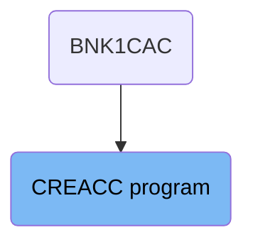
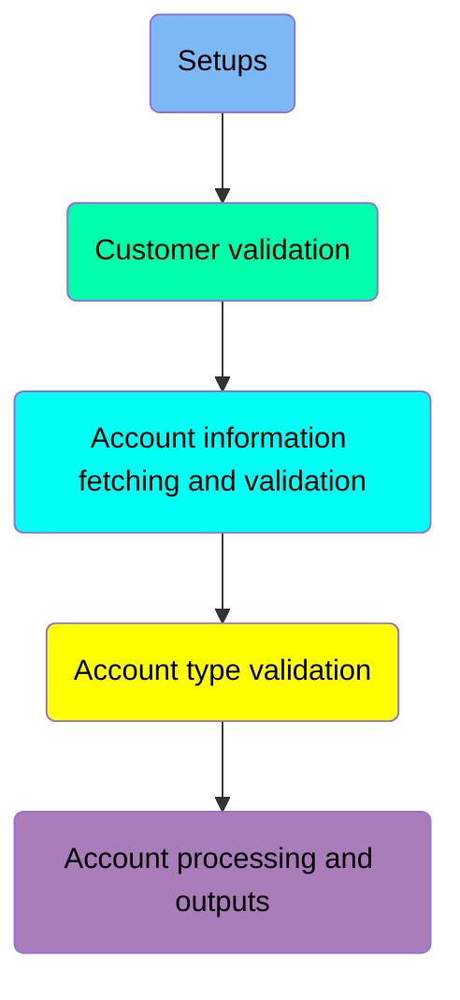
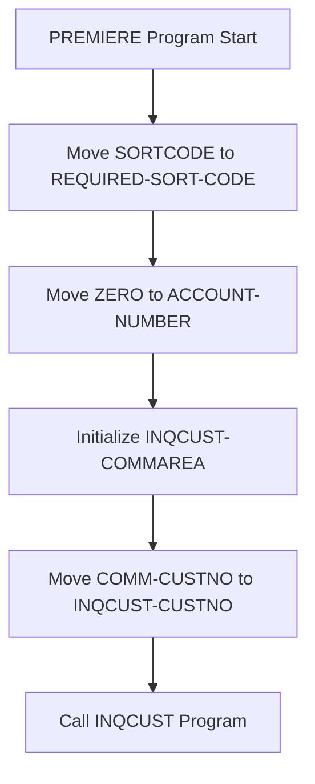
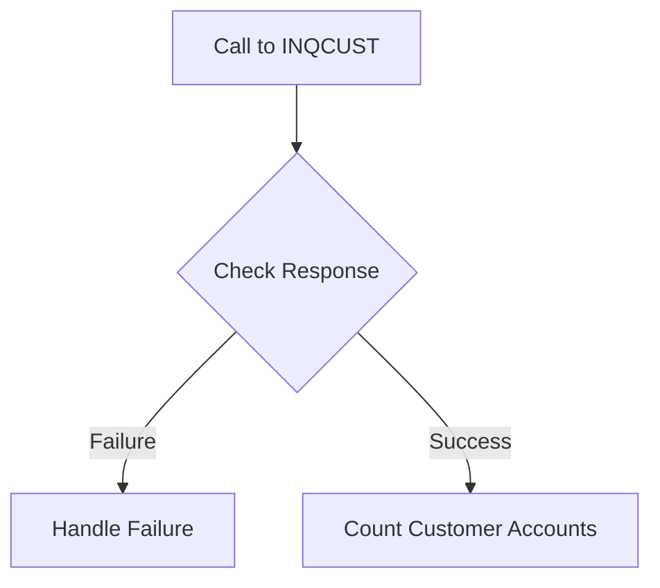
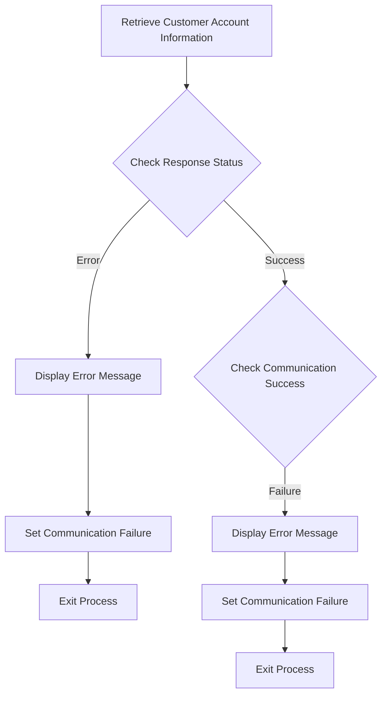
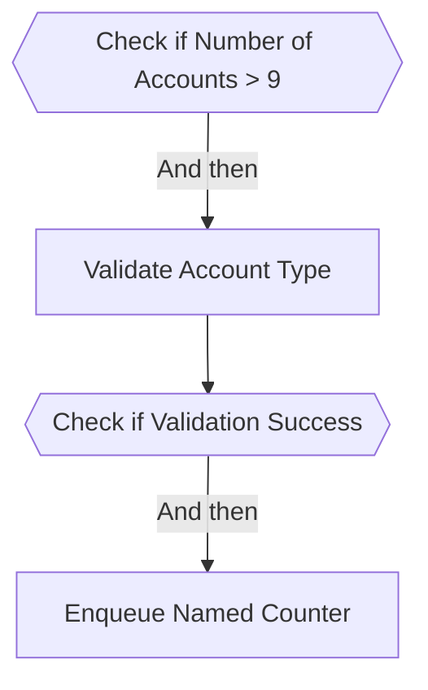
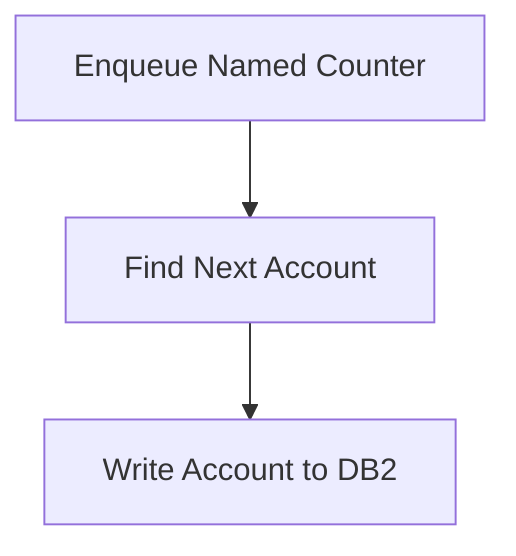

# Processing Account Creation (CREACC)

The CREACC program is responsible for creating new bank accounts. It starts by setting up necessary fields, validating customer information, and then proceeds to count and validate customer accounts. The program ensures that only valid account types are processed and handles any errors that may occur during the process. Finally, it enqueues a named counter, finds the next available account number, and writes the new account details to the <SwmToken path="src/base/cobol_src/CREACC.cbl" pos="376:7:7" line-data="           PERFORM WRITE-ACCOUNT-DB2">`DB2`</SwmToken> database.

The flow starts with setting up fields and validating customer information. If the customer is valid, it counts and validates the customer's accounts. It then ensures the account type is valid, enqueues a named counter, finds the next available account number, and writes the new account details to the <SwmToken path="src/base/cobol_src/CREACC.cbl" pos="376:7:7" line-data="           PERFORM WRITE-ACCOUNT-DB2">`DB2`</SwmToken> database.

## Where is this program used?

This program is used once, in a flow starting from `BNK1CAC` as represented in the following diagram:



Here is a high level diagram of the program:



## Setups



<SwmSnippet path="/src/base/cobol_src/CREACC.cbl" line="290">

---

### Moving SORTCODE to <SwmToken path="src/base/cobol_src/CREACC.cbl" pos="291:1:5" line-data="              REQUIRED-SORT-CODE">`REQUIRED-SORT-CODE`</SwmToken>

First, the <SwmToken path="src/base/cobol_src/CREACC.cbl" pos="290:3:3" line-data="           MOVE SORTCODE TO">`SORTCODE`</SwmToken> is moved to <SwmToken path="src/base/cobol_src/CREACC.cbl" pos="291:1:5" line-data="              REQUIRED-SORT-CODE">`REQUIRED-SORT-CODE`</SwmToken> and <SwmToken path="src/base/cobol_src/CREACC.cbl" pos="292:1:5" line-data="              REQUIRED-SORT-CODE2.">`REQUIRED-SORT-CODE2`</SwmToken>. This step ensures that the sort code is correctly set up for further processing.

```cobol
           MOVE SORTCODE TO
              REQUIRED-SORT-CODE
              REQUIRED-SORT-CODE2.
```

---

</SwmSnippet>

<SwmSnippet path="/src/base/cobol_src/CREACC.cbl" line="294">

---

### Moving ZERO to <SwmToken path="src/base/cobol_src/CREACC.cbl" pos="294:7:9" line-data="           MOVE ZERO TO ACCOUNT-NUMBER.">`ACCOUNT-NUMBER`</SwmToken>

Next, the <SwmToken path="src/base/cobol_src/CREACC.cbl" pos="294:7:9" line-data="           MOVE ZERO TO ACCOUNT-NUMBER.">`ACCOUNT-NUMBER`</SwmToken> is initialized to zero. This step prepares the account number field for subsequent operations.

```cobol
           MOVE ZERO TO ACCOUNT-NUMBER.
```

---

</SwmSnippet>

<SwmSnippet path="/src/base/cobol_src/CREACC.cbl" line="295">

---

### Initializing <SwmToken path="src/base/cobol_src/CREACC.cbl" pos="295:3:5" line-data="           INITIALIZE INQCUST-COMMAREA">`INQCUST-COMMAREA`</SwmToken>

Then, the <SwmToken path="src/base/cobol_src/CREACC.cbl" pos="295:3:5" line-data="           INITIALIZE INQCUST-COMMAREA">`INQCUST-COMMAREA`</SwmToken> is initialized. This step sets up the communication area for the <SwmToken path="src/base/cobol_src/CREACC.cbl" pos="295:3:3" line-data="           INITIALIZE INQCUST-COMMAREA">`INQCUST`</SwmToken> program call.

```cobol
           INITIALIZE INQCUST-COMMAREA
```

---

</SwmSnippet>

<SwmSnippet path="/src/base/cobol_src/CREACC.cbl" line="302">

---

### Moving <SwmToken path="src/base/cobol_src/CREACC.cbl" pos="302:3:5" line-data="           MOVE COMM-CUSTNO IN DFHCOMMAREA TO INQCUST-CUSTNO.">`COMM-CUSTNO`</SwmToken> to <SwmToken path="src/base/cobol_src/CREACC.cbl" pos="302:13:15" line-data="           MOVE COMM-CUSTNO IN DFHCOMMAREA TO INQCUST-CUSTNO.">`INQCUST-CUSTNO`</SwmToken>

Moving to the next step, the <SwmToken path="src/base/cobol_src/CREACC.cbl" pos="302:3:5" line-data="           MOVE COMM-CUSTNO IN DFHCOMMAREA TO INQCUST-CUSTNO.">`COMM-CUSTNO`</SwmToken> from <SwmToken path="src/base/cobol_src/CREACC.cbl" pos="302:9:9" line-data="           MOVE COMM-CUSTNO IN DFHCOMMAREA TO INQCUST-CUSTNO.">`DFHCOMMAREA`</SwmToken> is moved to <SwmToken path="src/base/cobol_src/CREACC.cbl" pos="302:13:15" line-data="           MOVE COMM-CUSTNO IN DFHCOMMAREA TO INQCUST-CUSTNO.">`INQCUST-CUSTNO`</SwmToken>. This step transfers the customer number to the communication area for validation.

```cobol
           MOVE COMM-CUSTNO IN DFHCOMMAREA TO INQCUST-CUSTNO.
```

---

</SwmSnippet>

<SwmSnippet path="/src/base/cobol_src/CREACC.cbl" line="304">

---

### Calling INQCUST Program

Finally, the <SwmToken path="src/base/cobol_src/CREACC.cbl" pos="304:10:10" line-data="           EXEC CICS LINK PROGRAM(&#39;INQCUST &#39;)">`INQCUST`</SwmToken> program is called using the <SwmToken path="src/base/cobol_src/CREACC.cbl" pos="304:1:5" line-data="           EXEC CICS LINK PROGRAM(&#39;INQCUST &#39;)">`EXEC CICS LINK`</SwmToken> command. This step validates the existence of the customer by linking to the <SwmToken path="src/base/cobol_src/CREACC.cbl" pos="304:10:10" line-data="           EXEC CICS LINK PROGRAM(&#39;INQCUST &#39;)">`INQCUST`</SwmToken> program.

More about INQCUST: <SwmLink doc-title="Get Customer Record (INQCUST)">[Get Customer Record (INQCUST)](/docs/Docs/get-customer-record-inqcust.md)</SwmLink>

```cobol
           EXEC CICS LINK PROGRAM('INQCUST ')
                     COMMAREA(INQCUST-COMMAREA)
                     RESP(WS-CICS-RESP)
           END-EXEC.
```

---

</SwmSnippet>

## Customer validation



<SwmSnippet path="/src/base/cobol_src/CREACC.cbl" line="304">

---

### Call to INQCUST

First, the program makes a call to the <SwmToken path="src/base/cobol_src/CREACC.cbl" pos="304:10:10" line-data="           EXEC CICS LINK PROGRAM(&#39;INQCUST &#39;)">`INQCUST`</SwmToken> program to retrieve customer information. This is done using the <SwmToken path="src/base/cobol_src/CREACC.cbl" pos="304:1:5" line-data="           EXEC CICS LINK PROGRAM(&#39;INQCUST &#39;)">`EXEC CICS LINK`</SwmToken> command, which links to the <SwmToken path="src/base/cobol_src/CREACC.cbl" pos="304:10:10" line-data="           EXEC CICS LINK PROGRAM(&#39;INQCUST &#39;)">`INQCUST`</SwmToken> program and passes the communication area <SwmToken path="src/base/cobol_src/CREACC.cbl" pos="305:3:5" line-data="                     COMMAREA(INQCUST-COMMAREA)">`INQCUST-COMMAREA`</SwmToken>.

More about INQCUST: <SwmLink doc-title="Get Customer Record (INQCUST)">[Get Customer Record (INQCUST)](/docs/Docs/get-customer-record-inqcust.md)</SwmLink>

```cobol
           EXEC CICS LINK PROGRAM('INQCUST ')
                     COMMAREA(INQCUST-COMMAREA)
                     RESP(WS-CICS-RESP)
           END-EXEC.
```

---

</SwmSnippet>

<SwmSnippet path="/src/base/cobol_src/CREACC.cbl" line="314">

---

### Check Response

Next, the program checks the response from the <SwmToken path="src/base/cobol_src/CREACC.cbl" pos="315:3:3" line-data="           OR INQCUST-INQ-SUCCESS IS NOT EQUAL TO &#39;Y&#39;">`INQCUST`</SwmToken> call. It verifies if the response code <SwmToken path="src/base/cobol_src/CREACC.cbl" pos="314:3:3" line-data="           IF EIBRESP IS NOT EQUAL TO DFHRESP(NORMAL)">`EIBRESP`</SwmToken> is normal and if the <SwmToken path="src/base/cobol_src/CREACC.cbl" pos="315:3:7" line-data="           OR INQCUST-INQ-SUCCESS IS NOT EQUAL TO &#39;Y&#39;">`INQCUST-INQ-SUCCESS`</SwmToken> flag is set to 'Y'. If either of these conditions is not met, it indicates a failure in retrieving customer information.

```cobol
           IF EIBRESP IS NOT EQUAL TO DFHRESP(NORMAL)
           OR INQCUST-INQ-SUCCESS IS NOT EQUAL TO 'Y'

```

---

</SwmSnippet>

<SwmSnippet path="/src/base/cobol_src/CREACC.cbl" line="317">

---

### Handle Failure

If the response check fails, the program sets the <SwmToken path="src/base/cobol_src/CREACC.cbl" pos="317:9:11" line-data="             MOVE &#39;N&#39; TO COMM-SUCCESS IN DFHCOMMAREA">`COMM-SUCCESS`</SwmToken> flag to 'N' and the <SwmToken path="src/base/cobol_src/CREACC.cbl" pos="318:9:13" line-data="             MOVE &#39;1&#39; TO COMM-FAIL-CODE IN DFHCOMMAREA">`COMM-FAIL-CODE`</SwmToken> to '1' in the <SwmToken path="src/base/cobol_src/CREACC.cbl" pos="317:15:15" line-data="             MOVE &#39;N&#39; TO COMM-SUCCESS IN DFHCOMMAREA">`DFHCOMMAREA`</SwmToken>. It then performs the <SwmToken path="src/base/cobol_src/CREACC.cbl" pos="320:3:11" line-data="             PERFORM GET-ME-OUT-OF-HERE">`GET-ME-OUT-OF-HERE`</SwmToken> section to handle the failure and exit.

```cobol
             MOVE 'N' TO COMM-SUCCESS IN DFHCOMMAREA
             MOVE '1' TO COMM-FAIL-CODE IN DFHCOMMAREA

             PERFORM GET-ME-OUT-OF-HERE

           END-IF
```

---

</SwmSnippet>

<SwmSnippet path="/src/base/cobol_src/CREACC.cbl" line="1080">

---

### Count Customer Accounts

If the response check is successful, the program proceeds to the <SwmToken path="src/base/cobol_src/CREACC.cbl" pos="1080:1:5" line-data="       CUSTOMER-ACCOUNT-COUNT SECTION.">`CUSTOMER-ACCOUNT-COUNT`</SwmToken> section. This section sets the number of accounts to 20 and moves the customer number from <SwmToken path="src/base/cobol_src/CREACC.cbl" pos="1083:9:9" line-data="           MOVE COMM-CUSTNO IN DFHCOMMAREA">`DFHCOMMAREA`</SwmToken> to <SwmToken path="src/base/cobol_src/CREACC.cbl" pos="1082:15:17" line-data="           MOVE 20 TO NUMBER-OF-ACCOUNTS IN INQACCCU-COMMAREA.">`INQACCCU-COMMAREA`</SwmToken>. It then makes a call to the <SwmToken path="src/base/cobol_src/CREACC.cbl" pos="1082:15:15" line-data="           MOVE 20 TO NUMBER-OF-ACCOUNTS IN INQACCCU-COMMAREA.">`INQACCCU`</SwmToken> program to retrieve the account details.

```cobol
       CUSTOMER-ACCOUNT-COUNT SECTION.
       CAC010.
           MOVE 20 TO NUMBER-OF-ACCOUNTS IN INQACCCU-COMMAREA.
           MOVE COMM-CUSTNO IN DFHCOMMAREA
             TO CUSTOMER-NUMBER IN INQACCCU-COMMAREA.

           SET COMM-PCB-POINTER TO NULL

           EXEC CICS LINK PROGRAM('INQACCCU')
                COMMAREA(INQACCCU-COMMAREA)
                RESP(WS-CICS-RESP)
                SYNCONRETURN
           END-EXEC.

       CAC999.
           EXIT.
```

---

</SwmSnippet>

### Interim Summary

So far, we saw how the program initializes various fields and makes a call to the <SwmToken path="src/base/cobol_src/CREACC.cbl" pos="295:3:3" line-data="           INITIALIZE INQCUST-COMMAREA">`INQCUST`</SwmToken> program to validate the customer. If the validation is successful, it proceeds to count the customer accounts by calling the <SwmToken path="src/base/cobol_src/CREACC.cbl" pos="332:15:15" line-data="             MOVE &#39;N&#39; to COMM-SUCCESS IN INQACCCU-COMMAREA">`INQACCCU`</SwmToken> program. Now, we will focus on how the program retrieves customer account information and handles any errors that may occur during this process.

## Account information fetching and validation



<SwmSnippet path="/src/base/cobol_src/CREACC.cbl" line="327">

---

### Retrieve Customer Account Information

First, the program performs the <SwmToken path="src/base/cobol_src/CREACC.cbl" pos="327:3:7" line-data="           PERFORM CUSTOMER-ACCOUNT-COUNT.">`CUSTOMER-ACCOUNT-COUNT`</SwmToken> paragraph to retrieve customer account information.

```cobol
           PERFORM CUSTOMER-ACCOUNT-COUNT.
```

---

</SwmSnippet>

<SwmSnippet path="/src/base/cobol_src/CREACC.cbl" line="329">

---

### Check Response Status

Next, the program checks if the response status <SwmToken path="src/base/cobol_src/CREACC.cbl" pos="329:3:7" line-data="           IF WS-CICS-RESP IS NOT EQUAL TO DFHRESP(NORMAL)">`WS-CICS-RESP`</SwmToken> is not equal to <SwmToken path="src/base/cobol_src/CREACC.cbl" pos="329:17:20" line-data="           IF WS-CICS-RESP IS NOT EQUAL TO DFHRESP(NORMAL)">`DFHRESP(NORMAL)`</SwmToken>. If the response is not normal, it displays an error message, sets the communication success flag to 'N', sets the communication failure code to '9', and then performs the <SwmToken path="src/base/cobol_src/CREACC.cbl" pos="335:3:11" line-data="             PERFORM GET-ME-OUT-OF-HERE">`GET-ME-OUT-OF-HERE`</SwmToken> paragraph to exit the process.

```cobol
           IF WS-CICS-RESP IS NOT EQUAL TO DFHRESP(NORMAL)
             DISPLAY 'Error counting accounts'
             MOVE 'N' to COMM-SUCCESS IN DFHCOMMAREA
             MOVE 'N' to COMM-SUCCESS IN INQACCCU-COMMAREA
             MOVE '9' TO COMM-FAIL-CODE IN DFHCOMMAREA

             PERFORM GET-ME-OUT-OF-HERE
           END-IF
```

---

</SwmSnippet>

<SwmSnippet path="/src/base/cobol_src/CREACC.cbl" line="338">

---

### Check Communication Success

Then, the program checks if the communication success flag <SwmToken path="src/base/cobol_src/CREACC.cbl" pos="338:3:5" line-data="           IF COMM-SUCCESS IN INQACCCU-COMMAREA = &#39;N&#39;">`COMM-SUCCESS`</SwmToken> in <SwmToken path="src/base/cobol_src/CREACC.cbl" pos="338:9:11" line-data="           IF COMM-SUCCESS IN INQACCCU-COMMAREA = &#39;N&#39;">`INQACCCU-COMMAREA`</SwmToken> is 'N'. If it is, it displays an error message, sets the communication success flag to 'N', sets the communication failure code to '9', and then performs the <SwmToken path="src/base/cobol_src/CREACC.cbl" pos="343:3:11" line-data="             PERFORM GET-ME-OUT-OF-HERE">`GET-ME-OUT-OF-HERE`</SwmToken> paragraph to exit the process.

```cobol
           IF COMM-SUCCESS IN INQACCCU-COMMAREA = 'N'
             DISPLAY 'Error counting accounts'
             MOVE 'N' to COMM-SUCCESS IN DFHCOMMAREA
             MOVE '9' TO COMM-FAIL-CODE IN DFHCOMMAREA

             PERFORM GET-ME-OUT-OF-HERE
           END-IF
```

---

</SwmSnippet>

## Account type validation



<SwmSnippet path="/src/base/cobol_src/CREACC.cbl" line="347">

---

### Checking Number of Accounts

First, the code checks if the number of accounts in <SwmToken path="src/base/cobol_src/CREACC.cbl" pos="347:11:13" line-data="           IF NUMBER-OF-ACCOUNTS IN INQACCCU-COMMAREA &gt; 9">`INQACCCU-COMMAREA`</SwmToken> is greater than 9. If true, it sets <SwmToken path="src/base/cobol_src/CREACC.cbl" pos="348:9:11" line-data="             MOVE &#39;N&#39; TO COMM-SUCCESS IN DFHCOMMAREA">`COMM-SUCCESS`</SwmToken> to 'N' and <SwmToken path="src/base/cobol_src/CREACC.cbl" pos="349:9:13" line-data="             MOVE &#39;8&#39; TO COMM-FAIL-CODE IN DFHCOMMAREA">`COMM-FAIL-CODE`</SwmToken> to '8', then performs <SwmToken path="src/base/cobol_src/CREACC.cbl" pos="351:3:11" line-data="             PERFORM GET-ME-OUT-OF-HERE">`GET-ME-OUT-OF-HERE`</SwmToken> to exit.

```cobol
           IF NUMBER-OF-ACCOUNTS IN INQACCCU-COMMAREA > 9
             MOVE 'N' TO COMM-SUCCESS IN DFHCOMMAREA
             MOVE '8' TO COMM-FAIL-CODE IN DFHCOMMAREA

             PERFORM GET-ME-OUT-OF-HERE
           END-IF
```

---

</SwmSnippet>

<SwmSnippet path="/src/base/cobol_src/CREACC.cbl" line="355">

---

### Validating Account Type

Next, the code performs <SwmToken path="src/base/cobol_src/CREACC.cbl" pos="357:3:7" line-data="           PERFORM ACCOUNT-TYPE-CHECK">`ACCOUNT-TYPE-CHECK`</SwmToken> to validate the type of account. This ensures that only valid account types like ISA, MORTGAGE, SAVING, CURRENT, and LOAN are accepted.

```cobol
      *    Validate the type of account e.g. MORTGAGE etc.
      *
           PERFORM ACCOUNT-TYPE-CHECK

```

---

</SwmSnippet>

<SwmSnippet path="/src/base/cobol_src/CREACC.cbl" line="1209">

---

#### <SwmToken path="src/base/cobol_src/CREACC.cbl" pos="1209:1:5" line-data="       ACCOUNT-TYPE-CHECK SECTION.">`ACCOUNT-TYPE-CHECK`</SwmToken>

The <SwmToken path="src/base/cobol_src/CREACC.cbl" pos="1209:1:5" line-data="       ACCOUNT-TYPE-CHECK SECTION.">`ACCOUNT-TYPE-CHECK`</SwmToken> section evaluates the account type in <SwmToken path="src/base/cobol_src/CREACC.cbl" pos="1216:11:11" line-data="              WHEN COMM-ACC-TYPE IN DFHCOMMAREA(1:3) = &#39;ISA&#39;">`DFHCOMMAREA`</SwmToken>. If the account type matches one of the valid types, it sets <SwmToken path="src/base/cobol_src/CREACC.cbl" pos="1221:9:11" line-data="                 MOVE &#39;Y&#39; TO COMM-SUCCESS OF DFHCOMMAREA">`COMM-SUCCESS`</SwmToken> to 'Y'. Otherwise, it sets <SwmToken path="src/base/cobol_src/CREACC.cbl" pos="1221:9:11" line-data="                 MOVE &#39;Y&#39; TO COMM-SUCCESS OF DFHCOMMAREA">`COMM-SUCCESS`</SwmToken> to 'N' and <SwmToken path="src/base/cobol_src/CREACC.cbl" pos="1224:9:13" line-data="                 MOVE &#39;A&#39; TO COMM-FAIL-CODE IN DFHCOMMAREA">`COMM-FAIL-CODE`</SwmToken> to 'A'.

```cobol
       ACCOUNT-TYPE-CHECK SECTION.
       ATC010.
      *
      *    Validate that only ISA, MORTGAGE, SAVING, CURRENT and LOAN
      *    are the only account types available.
      *
           EVALUATE TRUE
              WHEN COMM-ACC-TYPE IN DFHCOMMAREA(1:3) = 'ISA'
              WHEN COMM-ACC-TYPE IN DFHCOMMAREA(1:8) = 'MORTGAGE'
              WHEN COMM-ACC-TYPE IN DFHCOMMAREA(1:6) = 'SAVING'
              WHEN COMM-ACC-TYPE IN DFHCOMMAREA(1:7) = 'CURRENT'
              WHEN COMM-ACC-TYPE IN DFHCOMMAREA(1:4) = 'LOAN'
                 MOVE 'Y' TO COMM-SUCCESS OF DFHCOMMAREA
              WHEN OTHER
                 MOVE 'N' TO COMM-SUCCESS OF DFHCOMMAREA
                 MOVE 'A' TO COMM-FAIL-CODE IN DFHCOMMAREA
           END-EVALUATE.

       ATC999.
           EXIT.
```

---

</SwmSnippet>

<SwmSnippet path="/src/base/cobol_src/CREACC.cbl" line="359">

---

### Checking Validation Success

Then, the code checks if <SwmToken path="src/base/cobol_src/CREACC.cbl" pos="359:3:5" line-data="           IF COMM-SUCCESS OF DFHCOMMAREA = &#39;N&#39;">`COMM-SUCCESS`</SwmToken> is 'N'. If true, it performs <SwmToken path="src/base/cobol_src/CREACC.cbl" pos="360:3:11" line-data="             PERFORM GET-ME-OUT-OF-HERE">`GET-ME-OUT-OF-HERE`</SwmToken> to exit.

```cobol
           IF COMM-SUCCESS OF DFHCOMMAREA = 'N'
             PERFORM GET-ME-OUT-OF-HERE
           END-IF
```

---

</SwmSnippet>

<SwmSnippet path="/src/base/cobol_src/CREACC.cbl" line="385">

---

#### <SwmToken path="src/base/cobol_src/CREACC.cbl" pos="385:1:5" line-data="       ENQ-NAMED-COUNTER SECTION.">`ENQ-NAMED-COUNTER`</SwmToken>

The <SwmToken path="src/base/cobol_src/CREACC.cbl" pos="385:1:5" line-data="       ENQ-NAMED-COUNTER SECTION.">`ENQ-NAMED-COUNTER`</SwmToken> section enqueues a named counter using the <SwmToken path="src/base/cobol_src/CREACC.cbl" pos="388:3:3" line-data="           MOVE SORTCODE TO NCS-ACC-NO-TEST-SORT.">`SORTCODE`</SwmToken>. If the response is not normal, it sets <SwmToken path="src/base/cobol_src/CREACC.cbl" pos="398:9:11" line-data="             MOVE &#39;N&#39; TO COMM-SUCCESS IN DFHCOMMAREA">`COMM-SUCCESS`</SwmToken> to 'N' and <SwmToken path="src/base/cobol_src/CREACC.cbl" pos="399:9:13" line-data="             MOVE &#39;3&#39; TO COMM-FAIL-CODE IN DFHCOMMAREA">`COMM-FAIL-CODE`</SwmToken> to '3', then performs <SwmToken path="src/base/cobol_src/CREACC.cbl" pos="400:3:11" line-data="             PERFORM GET-ME-OUT-OF-HERE">`GET-ME-OUT-OF-HERE`</SwmToken> to exit.

```cobol
       ENQ-NAMED-COUNTER SECTION.
       ENC010.

           MOVE SORTCODE TO NCS-ACC-NO-TEST-SORT.

           EXEC CICS ENQ
              RESOURCE(NCS-ACC-NO-NAME)
              LENGTH(16)
              RESP(WS-CICS-RESP)
              RESP2(WS-CICS-RESP2)
           END-EXEC.

           IF WS-CICS-RESP NOT = DFHRESP(NORMAL)
             MOVE 'N' TO COMM-SUCCESS IN DFHCOMMAREA
             MOVE '3' TO COMM-FAIL-CODE IN DFHCOMMAREA
             PERFORM GET-ME-OUT-OF-HERE
           END-IF.

       ENC999.
           EXIT.
```

---

</SwmSnippet>

## Account processing and outputs



<SwmSnippet path="/src/base/cobol_src/CREACC.cbl" line="369">

---

### Enqueue Named Counter

First, we enqueue the named counter for the account. This ensures that the account number generation is synchronized and unique.

```cobol
           PERFORM ENQ-NAMED-COUNTER.
```

---

</SwmSnippet>

<SwmSnippet path="/src/base/cobol_src/CREACC.cbl" line="374">

---

### Find Next Account

Next, we perform the <SwmToken path="src/base/cobol_src/CREACC.cbl" pos="374:3:7" line-data="           PERFORM FIND-NEXT-ACCOUNT.">`FIND-NEXT-ACCOUNT`</SwmToken> operation to retrieve the next available account number from the account control table.

```cobol
           PERFORM FIND-NEXT-ACCOUNT.
```

---

</SwmSnippet>

<SwmSnippet path="/src/base/cobol_src/CREACC.cbl" line="429">

---

#### <SwmToken path="src/base/cobol_src/CREACC.cbl" pos="429:1:5" line-data="       FIND-NEXT-ACCOUNT SECTION.">`FIND-NEXT-ACCOUNT`</SwmToken>

The <SwmToken path="src/base/cobol_src/CREACC.cbl" pos="429:1:5" line-data="       FIND-NEXT-ACCOUNT SECTION.">`FIND-NEXT-ACCOUNT`</SwmToken> section increments the account number and retrieves the current control values from the database. If the SQL operation fails, it handles the error by logging and abending the transaction.

```cobol
       FIND-NEXT-ACCOUNT SECTION.
       FNA010.

           MOVE 1 TO NCS-ACC-NO-INC.

           INITIALIZE OUTPUT-DATA.

      * <<sortcode>>-ACCOUNT-LAST
           MOVE SPACES TO HV-CONTROL-NAME
           MOVE ZERO TO HV-CONTROL-VALUE-NUM
           MOVE SPACES TO HV-CONTROL-VALUE-STR
           STRING REQUIRED-SORT-CODE DELIMITED BY SIZE
           '-' DELIMITED BY SIZE
           'ACCOUNT-LAST' DELIMITED BY SIZE
           INTO HV-CONTROL-NAME
           EXEC SQL
              SELECT CONTROL_NAME,
                       CONTROL_VALUE_NUM,
                       CONTROL_VALUE_STR
              INTO :HV-CONTROL-NAME,
                      :HV-CONTROL-VALUE-NUM,
```

---

</SwmSnippet>

<SwmSnippet path="/src/base/cobol_src/CREACC.cbl" line="376">

---

### Write Account to <SwmToken path="src/base/cobol_src/CREACC.cbl" pos="376:7:7" line-data="           PERFORM WRITE-ACCOUNT-DB2">`DB2`</SwmToken>

Then, we perform the <SwmToken path="src/base/cobol_src/CREACC.cbl" pos="376:3:7" line-data="           PERFORM WRITE-ACCOUNT-DB2">`WRITE-ACCOUNT-DB2`</SwmToken> operation to insert the new account details into the <SwmToken path="src/base/cobol_src/CREACC.cbl" pos="376:7:7" line-data="           PERFORM WRITE-ACCOUNT-DB2">`DB2`</SwmToken> database.

```cobol
           PERFORM WRITE-ACCOUNT-DB2
```

---

</SwmSnippet>

<SwmSnippet path="/src/base/cobol_src/CREACC.cbl" line="774">

---

#### <SwmToken path="src/base/cobol_src/CREACC.cbl" pos="774:1:5" line-data="       WRITE-ACCOUNT-DB2 SECTION.">`WRITE-ACCOUNT-DB2`</SwmToken>

The <SwmToken path="src/base/cobol_src/CREACC.cbl" pos="774:1:5" line-data="       WRITE-ACCOUNT-DB2 SECTION.">`WRITE-ACCOUNT-DB2`</SwmToken> section initializes the account row, sets the account details, calculates the next statement date, and inserts the account into the <SwmToken path="src/base/cobol_src/CREACC.cbl" pos="774:5:5" line-data="       WRITE-ACCOUNT-DB2 SECTION.">`DB2`</SwmToken> database. If the insert fails, it handles the error by logging and abending the transaction.

```cobol
       WRITE-ACCOUNT-DB2 SECTION.
       WAD010.

           INITIALIZE HOST-ACCOUNT-ROW.
           MOVE 'ACCT' TO HV-ACCOUNT-EYECATCHER.
           MOVE COMM-CUSTNO IN DFHCOMMAREA  TO HV-ACCOUNT-CUST-NO.
           MOVE SORTCODE  TO HV-ACCOUNT-SORTCODE.

           MOVE NCS-ACC-NO-VALUE TO NCS-ACC-NO-DISP.
           MOVE NCS-ACC-NO-DISP(9:8) TO HV-ACCOUNT-ACC-NO.
           MOVE COMM-ACC-TYPE IN DFHCOMMAREA    TO HV-ACCOUNT-ACC-TYPE.
           MOVE COMM-INT-RT      TO HV-ACCOUNT-INT-RATE.
           MOVE COMM-OVERDR-LIM  TO HV-ACCOUNT-OVERDRAFT-LIM.
           MOVE COMM-AVAIL-BAL IN DFHCOMMAREA   TO HV-ACCOUNT-AVAIL-BAL.
           MOVE COMM-ACT-BAL     TO HV-ACCOUNT-ACTUAL-BAL.

           PERFORM CALCULATE-DATES.

      *
      *    Convert gregorian date (YYYYMMDD) to an integer
      *
```

---

</SwmSnippet>

&nbsp;

*This is an auto-generated document by Swimm 🌊 and has not yet been verified by a human*

<SwmMeta version="3.0.0" repo-id="Z2l0aHViJTNBJTNBY2ljcy1iYW5raW5nLXNhbXBsZS1hcHBsaWNhdGlvbi1jYnNhLUlCTS1EZW1vJTNBJTNBU3dpbW0tRGVtbw==" repo-name="cics-banking-sample-application-cbsa-IBM-Demo"></SwmMeta>
