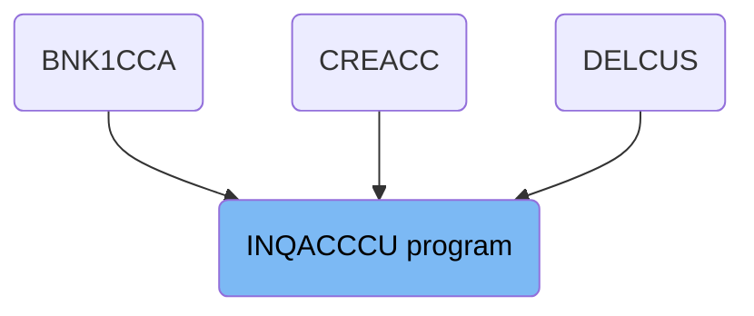

# Retrieving Customer Accounts (INQACCCU)

The INQACCCU program is responsible for inquiring about customer accounts. It is used in multiple parts of the system to retrieve and verify customer information. The program achieves this by performing a series of checks and database operations to ensure the customer exists and their account details are accurate.

The flow starts with initializing communication codes and setting up an ABEND handler. It then checks if the customer exists in the database. If the customer is not found, it exits the process. If the customer is found, it retrieves account information from the database and completes the transaction.

## Where is this program used?

This program is used multiple times in the codebase as represented in the following diagram:



Lets' zoom into the flow:

```mermaid
graph TD
  premiere("Start PREMIERE Section"):::a0d8d6d1e --> customer-check("Perform CUSTOMER-CHECK")
  customer-check --> id-0{{"IF CUSTOMER-FOUND = 'N'"}}
  id-0 -->|Yes| get-me-out-of-here("Perform GET-ME-OUT-OF-HERE")
  id-0 -->|No| read-account-db2("Perform READ-ACCOUNT-DB2")
  read-account-db2 --> get-me-out-of-here("Perform GET-ME-OUT-OF-HERE")
  classDef a0d8d6d1e color:#000000,fill:#7CB9F4

%% Swimm:
%% graph TD
%%   premiere("Start PREMIERE Section"):::a0d8d6d1e --> customer-check("Perform CUSTOMER-CHECK")
%%   customer-check --> id-0{{"IF <SwmToken path="src/base/cobol_src/INQACCCU.cbl" pos="215:3:5" line-data="           IF CUSTOMER-FOUND = &#39;N&#39;">`CUSTOMER-FOUND`</SwmToken> = 'N'"}}
%%   id-0 -->|Yes| get-me-out-of-here("Perform GET-ME-OUT-OF-HERE")
%%   id-0 -->|No| read-account-db2("Perform READ-ACCOUNT-DB2")
%%   read-account-db2 --> get-me-out-of-here("Perform GET-ME-OUT-OF-HERE")
%%   classDef a0d8d6d1e color:#000000,fill:#7CB9F4
```



<SwmSnippet path="/src/base/cobol_src/INQACCCU.cbl" line="194">

---

### Start PREMIERE Section

First, the <SwmToken path="src/base/cobol_src/INQACCCU.cbl" pos="194:1:1" line-data="       PREMIERE SECTION.">`PREMIERE`</SwmToken> section initializes communication success and failure codes. It then sets up an ABEND (abnormal end) handler to manage unexpected terminations. This ensures that any issues during execution are properly handled.

```cobol
       PREMIERE SECTION.
       A010.
           MOVE 'N' TO COMM-SUCCESS
           MOVE '0' TO COMM-FAIL-CODE

           EXEC CICS HANDLE ABEND
              LABEL(ABEND-HANDLING)
           END-EXEC.

           MOVE SORTCODE TO REQUIRED-SORT-CODE OF CUSTOMER-KY.

```

---

</SwmSnippet>

<SwmSnippet path="/src/base/cobol_src/INQACCCU.cbl" line="210">

---

### Perform <SwmToken path="src/base/cobol_src/INQACCCU.cbl" pos="210:3:5" line-data="           PERFORM CUSTOMER-CHECK.">`CUSTOMER-CHECK`</SwmToken>

Next, the <SwmToken path="src/base/cobol_src/INQACCCU.cbl" pos="210:3:5" line-data="           PERFORM CUSTOMER-CHECK.">`CUSTOMER-CHECK`</SwmToken> paragraph is performed to retrieve customer information. This step is crucial as it determines if the customer exists in the database.

```cobol
           PERFORM CUSTOMER-CHECK.
```

---

</SwmSnippet>

<SwmSnippet path="/src/base/cobol_src/INQACCCU.cbl" line="829">

---

#### <SwmToken path="src/base/cobol_src/INQACCCU.cbl" pos="829:1:3" line-data="       CUSTOMER-CHECK SECTION.">`CUSTOMER-CHECK`</SwmToken> Paragraph

The <SwmToken path="src/base/cobol_src/INQACCCU.cbl" pos="829:1:3" line-data="       CUSTOMER-CHECK SECTION.">`CUSTOMER-CHECK`</SwmToken> paragraph checks if the customer number is valid. If the customer number is zero or a specific invalid number, it sets <SwmToken path="src/base/cobol_src/INQACCCU.cbl" pos="836:9:11" line-data="              MOVE &#39;N&#39; TO CUSTOMER-FOUND">`CUSTOMER-FOUND`</SwmToken> to 'N'. Otherwise, it links to the <SwmToken path="src/base/cobol_src/INQACCCU.cbl" pos="832:15:15" line-data="      *    Retrieve customer information by linking to INQCUST">`INQCUST`</SwmToken> program to retrieve customer information and sets <SwmToken path="src/base/cobol_src/INQACCCU.cbl" pos="836:9:11" line-data="              MOVE &#39;N&#39; TO CUSTOMER-FOUND">`CUSTOMER-FOUND`</SwmToken> based on the success of this operation.

More about INQCUST: <SwmLink doc-title="Get Customer Record (INQCUST)">[Get Customer Record (INQCUST)](/docs/Docs/get-customer-record-inqcust.md)</SwmLink>

```cobol
       CUSTOMER-CHECK SECTION.
       CC010.
      *
      *    Retrieve customer information by linking to INQCUST
      *

           IF CUSTOMER-NUMBER IN DFHCOMMAREA = ZERO
              MOVE 'N' TO CUSTOMER-FOUND
              MOVE ZERO TO NUMBER-OF-ACCOUNTS
              GO TO CC999
           END-IF.

           IF CUSTOMER-NUMBER IN DFHCOMMAREA = '9999999999'
              MOVE 'N' TO CUSTOMER-FOUND
              MOVE ZERO TO NUMBER-OF-ACCOUNTS
              GO TO CC999
           END-IF.

           INITIALIZE INQCUST-COMMAREA.

           MOVE CUSTOMER-NUMBER IN DFHCOMMAREA TO INQCUST-CUSTNO.
```

---

</SwmSnippet>

<SwmSnippet path="/src/base/cobol_src/INQACCCU.cbl" line="215">

---

### Check <SwmToken path="src/base/cobol_src/INQACCCU.cbl" pos="215:3:5" line-data="           IF CUSTOMER-FOUND = &#39;N&#39;">`CUSTOMER-FOUND`</SwmToken>

Then, the code checks if <SwmToken path="src/base/cobol_src/INQACCCU.cbl" pos="215:3:5" line-data="           IF CUSTOMER-FOUND = &#39;N&#39;">`CUSTOMER-FOUND`</SwmToken> is 'N'. If true, it sets the communication success to 'N' and the failure code to '1', and performs the <SwmToken path="src/base/cobol_src/INQACCCU.cbl" pos="218:3:11" line-data="              PERFORM GET-ME-OUT-OF-HERE">`GET-ME-OUT-OF-HERE`</SwmToken> paragraph to exit the process.

```cobol
           IF CUSTOMER-FOUND = 'N'
              MOVE 'N' TO COMM-SUCCESS
              MOVE '1' TO COMM-FAIL-CODE
              PERFORM GET-ME-OUT-OF-HERE
           END-IF
```

---

</SwmSnippet>

<SwmSnippet path="/src/base/cobol_src/INQACCCU.cbl" line="638">

---

#### <SwmToken path="src/base/cobol_src/INQACCCU.cbl" pos="638:1:9" line-data="       GET-ME-OUT-OF-HERE SECTION.">`GET-ME-OUT-OF-HERE`</SwmToken> Paragraph

The <SwmToken path="src/base/cobol_src/INQACCCU.cbl" pos="638:1:9" line-data="       GET-ME-OUT-OF-HERE SECTION.">`GET-ME-OUT-OF-HERE`</SwmToken> paragraph returns control back to CICS, effectively ending the current transaction.

```cobol
       GET-ME-OUT-OF-HERE SECTION.
       GMOFH010.
      *
      *    Return control back to CICS
      *
           EXEC CICS RETURN
           END-EXEC.

           GOBACK.

       GMOFH999.
           EXIT.
```

---

</SwmSnippet>

<SwmSnippet path="/src/base/cobol_src/INQACCCU.cbl" line="222">

---

### Perform <SwmToken path="src/base/cobol_src/INQACCCU.cbl" pos="222:3:7" line-data="           PERFORM READ-ACCOUNT-DB2">`READ-ACCOUNT-DB2`</SwmToken>

If the customer is found, the <SwmToken path="src/base/cobol_src/INQACCCU.cbl" pos="222:3:7" line-data="           PERFORM READ-ACCOUNT-DB2">`READ-ACCOUNT-DB2`</SwmToken> paragraph is performed to retrieve account information from the database.

```cobol
           PERFORM READ-ACCOUNT-DB2
```

---

</SwmSnippet>

<SwmSnippet path="/src/base/cobol_src/INQACCCU.cbl" line="233">

---

#### <SwmToken path="src/base/cobol_src/INQACCCU.cbl" pos="233:1:5" line-data="       READ-ACCOUNT-DB2 SECTION.">`READ-ACCOUNT-DB2`</SwmToken> Paragraph

The <SwmToken path="src/base/cobol_src/INQACCCU.cbl" pos="233:1:5" line-data="       READ-ACCOUNT-DB2 SECTION.">`READ-ACCOUNT-DB2`</SwmToken> paragraph opens a <SwmToken path="src/base/cobol_src/INQACCCU.cbl" pos="233:5:5" line-data="       READ-ACCOUNT-DB2 SECTION.">`DB2`</SwmToken> cursor to fetch account data associated with the customer. It handles SQL errors and performs necessary rollback operations if any issues occur. Finally, it closes the cursor and sets the communication success flag.

```cobol
       READ-ACCOUNT-DB2 SECTION.
       RAD010.
      *
      *    Get accounts from account datastore
      *

      *
      *    Open the DB2 CURSOR
      *

           MOVE CUSTOMER-NUMBER IN DFHCOMMAREA TO HV-ACCOUNT-CUST-NO.
           MOVE  SORTCODE TO HV-ACCOUNT-SORTCODE.

           EXEC SQL OPEN
              ACC-CURSOR
           END-EXEC.

           MOVE SQLCODE TO SQLCODE-DISPLAY.

           IF SQLCODE NOT = 0
              MOVE SQLCODE TO SQLCODE-DISPLAY
```

---

</SwmSnippet>

<SwmSnippet path="/src/base/cobol_src/INQACCCU.cbl" line="227">

---

### Perform <SwmToken path="src/base/cobol_src/INQACCCU.cbl" pos="227:3:11" line-data="           PERFORM GET-ME-OUT-OF-HERE.">`GET-ME-OUT-OF-HERE`</SwmToken>

Finally, the <SwmToken path="src/base/cobol_src/INQACCCU.cbl" pos="227:3:11" line-data="           PERFORM GET-ME-OUT-OF-HERE.">`GET-ME-OUT-OF-HERE`</SwmToken> paragraph is performed again to return control back to CICS, completing the transaction.

```cobol
           PERFORM GET-ME-OUT-OF-HERE.
```

---

</SwmSnippet>

&nbsp;

*This is an auto-generated document by Swimm 🌊 and has not yet been verified by a human*

<SwmMeta version="3.0.0" repo-id="Z2l0aHViJTNBJTNBY2ljcy1iYW5raW5nLXNhbXBsZS1hcHBsaWNhdGlvbi1jYnNhLUlCTS1EZW1vJTNBJTNBU3dpbW0tRGVtbw==" repo-name="cics-banking-sample-application-cbsa-IBM-Demo"></SwmMeta>
