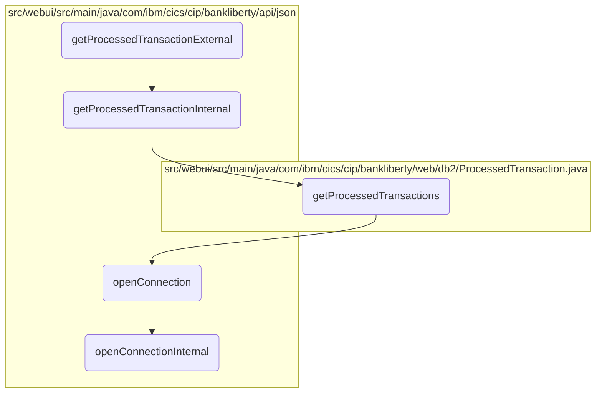

# Transaction Data Retrieval and Processing Flow

In this document, we will explain the process of retrieving and processing transaction data. The process involves initiating the retrieval, handling core logic, executing an SQL query, and ensuring a database connection.

The flow starts by calling a method to initiate the retrieval of transaction data. This method then calls another method to handle the core logic, which includes setting default values and fetching the transaction data. The data is retrieved by executing an SQL query, and each transaction is processed and formatted. Finally, the database connection is ensured to be open and properly managed throughout the process.

## Flow drill down



<SwmSnippet path="/src/webui/src/main/java/com/ibm/cics/cip/bankliberty/api/json/ProcessedTransactionResource.java" line="94">

---

### Retrieving and processing transaction data

First, the <SwmToken path="src/webui/src/main/java/com/ibm/cics/cip/bankliberty/api/json/ProcessedTransactionResource.java" pos="96:5:5" line-data="	public Response getProcessedTransactionExternal(">`getProcessedTransactionExternal`</SwmToken> method is called to initiate the process of retrieving transaction data. This method calls <SwmToken path="src/webui/src/main/java/com/ibm/cics/cip/bankliberty/api/json/ProcessedTransactionResource.java" pos="100:7:7" line-data="		Response myResponse = getProcessedTransactionInternal(limit, offset);">`getProcessedTransactionInternal`</SwmToken> to handle the core logic and then terminates the database connection.

```java
	@GET
	@Produces(MediaType.APPLICATION_JSON)
	public Response getProcessedTransactionExternal(
			@QueryParam(LIMIT) Integer limit,
			@QueryParam(OFFSET) Integer offset)
	{
		Response myResponse = getProcessedTransactionInternal(limit, offset);
		HBankDataAccess myHBankDataAccess = new HBankDataAccess();
		myHBankDataAccess.terminate();
		return myResponse;
	}
```

---

</SwmSnippet>

<SwmSnippet path="/src/webui/src/main/java/com/ibm/cics/cip/bankliberty/api/json/ProcessedTransactionResource.java" line="107">

---

Next, the <SwmToken path="src/webui/src/main/java/com/ibm/cics/cip/bankliberty/api/json/ProcessedTransactionResource.java" pos="107:5:5" line-data="	public Response getProcessedTransactionInternal(">`getProcessedTransactionInternal`</SwmToken> method sets default values for limit and offset if they are not provided. It retrieves the sort code and calls <SwmToken path="src/webui/src/main/java/com/ibm/cics/cip/bankliberty/web/db2/ProcessedTransaction.java" pos="224:7:7" line-data="	public ProcessedTransaction[] getProcessedTransactions(int sortCode,">`getProcessedTransactions`</SwmToken> to fetch the transaction data. If the data is not accessible, it returns an error response. Otherwise, it processes each transaction, formats the data, and returns it in a JSON response.

```java
	public Response getProcessedTransactionInternal(
			@QueryParam(LIMIT) Integer limit,
			@QueryParam(OFFSET) Integer offset)
	{

		if (offset == null)
		{
			offset = 0;
		}
		if (limit == null)
		{
			limit = 250000;
		}
		JSONObject response = new JSONObject();
		JSONArray processedTransactionsJSON = null;
		int numberOfProcessedTransactions = 0;
		Integer sortCode = this.getSortCode();

		com.ibm.cics.cip.bankliberty.web.db2.ProcessedTransaction myProcessedTransaction = new com.ibm.cics.cip.bankliberty.web.db2.ProcessedTransaction();
		com.ibm.cics.cip.bankliberty.web.db2.ProcessedTransaction[] processedTransactions = null;
		
```

---

</SwmSnippet>

<SwmSnippet path="/src/webui/src/main/java/com/ibm/cics/cip/bankliberty/web/db2/ProcessedTransaction.java" line="224">

---

Then, the <SwmToken path="src/webui/src/main/java/com/ibm/cics/cip/bankliberty/web/db2/ProcessedTransaction.java" pos="224:7:7" line-data="	public ProcessedTransaction[] getProcessedTransactions(int sortCode,">`getProcessedTransactions`</SwmToken> method constructs and executes an SQL query to retrieve transactions from the database. It processes each transaction record, handling different transaction types, and returns an array of <SwmToken path="src/webui/src/main/java/com/ibm/cics/cip/bankliberty/web/db2/ProcessedTransaction.java" pos="224:3:3" line-data="	public ProcessedTransaction[] getProcessedTransactions(int sortCode,">`ProcessedTransaction`</SwmToken> objects.

```java
	public ProcessedTransaction[] getProcessedTransactions(int sortCode,
			Integer limit, Integer offset)
	{
		logger.entering(this.getClass().getName(), GET_PROCESSED_TRANSACTIONS);

		ProcessedTransaction[] temp = new ProcessedTransaction[limit];

		this.offset = offset.intValue();
		this.limit = limit.intValue();

		StringBuilder myStringBuilder = new StringBuilder();

		for (int i = Integer.toString(sortCode).length(); i < SORT_CODE_LENGTH; i++)
		{
			myStringBuilder.append('0');
		}

		myStringBuilder.append(Integer.toString(sortCode));
		String sortCodeString = myStringBuilder.toString();

		openConnection();
```

---

</SwmSnippet>

<SwmSnippet path="/src/webui/src/main/java/com/ibm/cics/cip/bankliberty/api/json/HBankDataAccess.java" line="69">

---

Moving to the <SwmToken path="src/webui/src/main/java/com/ibm/cics/cip/bankliberty/api/json/HBankDataAccess.java" pos="69:5:5" line-data="	protected void openConnection()">`openConnection`</SwmToken> method, it ensures a connection to the <SwmToken path="src/webui/src/main/java/com/ibm/cics/cip/bankliberty/api/json/HBankDataAccess.java" pos="71:13:13" line-data="		// Open a connection to the DB2 database">`DB2`</SwmToken> database is open. If the connection is closed or does not exist, it calls <SwmToken path="src/webui/src/main/java/com/ibm/cics/cip/bankliberty/api/json/HBankDataAccess.java" pos="87:1:1" line-data="			openConnectionInternal();">`openConnectionInternal`</SwmToken> to establish a new connection.

```java
	protected void openConnection()
	{
		// Open a connection to the DB2 database
		logger.entering(this.getClass().getName(), "openConnection()");

		Integer taskNumberInteger = Task.getTask().getTaskNumber();
		String db2ConnString = DB2CONN.concat(taskNumberInteger.toString());
		logger.log(Level.FINE,
				() -> "Attempting to get DB2CONN for task number "
						+ taskNumberInteger.toString());
		this.conn = (Connection) cornedBeef.get(db2ConnString);
		if (this.conn == null)
		{
			HBankDataAccess.incrementConnCount();
			logger.log(Level.FINE,
					() -> "Attempting to create DB2CONN for task number "
							+ taskNumberInteger.toString());
			// Attempt to open a connection
			openConnectionInternal();
			logger.log(Level.FINE,
					() -> "Creation succcessful for DB2CONN for task number "
```

---

</SwmSnippet>

<SwmSnippet path="/src/webui/src/main/java/com/ibm/cics/cip/bankliberty/api/json/HBankDataAccess.java" line="162">

---

Finally, the <SwmToken path="src/webui/src/main/java/com/ibm/cics/cip/bankliberty/api/json/HBankDataAccess.java" pos="163:3:3" line-data="	void openConnectionInternal()">`openConnectionInternal`</SwmToken> method attempts to get a connection from the data source. If successful, it sets the transaction isolation level and stores the connection for reuse.

```java
	@SuppressWarnings("unchecked")
	void openConnectionInternal()
	{
		logger.entering(this.getClass().getName(), "openConnectionInternal");
		String jndiString = "jdbc/defaultCICSDataSource";
		Context ctx;

		try
		{
			ctx = new InitialContext();
			DataSource ds = (DataSource) ctx.lookup(jndiString);
			logger.log(Level.FINE, () -> "jndi string is " + jndiString);
			// If there is no current connection
			if (this.conn == null)
			{
				logger.log(Level.FINE,
						() -> "About to attempt to get DB2 connection");
				// Try and get a connection
				this.conn = ds.getConnection();
				this.conn.setTransactionIsolation(
						Connection.TRANSACTION_READ_UNCOMMITTED);
```

---

</SwmSnippet>

&nbsp;

*This is an auto-generated document by Swimm 🌊 and has not yet been verified by a human*

<SwmMeta version="3.0.0" repo-id="Z2l0aHViJTNBJTNBY2ljcy1iYW5raW5nLXNhbXBsZS1hcHBsaWNhdGlvbi1jYnNhLUlCTS1EZW1vJTNBJTNBU3dpbW0tRGVtbw==" repo-name="cics-banking-sample-application-cbsa-IBM-Demo"></SwmMeta>
