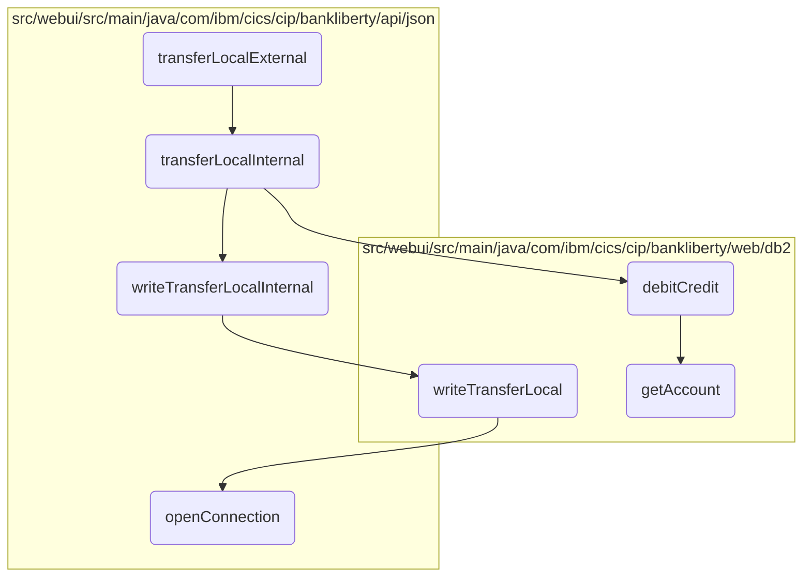

# Transferring Funds Between Accounts

In this document, we will explain the process of transferring funds between two accounts within the same bank. The process involves several steps including validation, internal transfer, updating account balances, recording the transaction, and ensuring database connectivity.

The flow starts with validating the account number and transfer amount. If valid, it proceeds to check if the source and target accounts are different and if the transfer amount is positive. Then, it verifies the existence and accessibility of both accounts. If all checks pass, it debits the source account and credits the target account. The transaction is then recorded in the database, and the connection to the database is managed to ensure all operations are performed smoothly.

## Flow drill down



<SwmSnippet path="/src/webui/src/main/java/com/ibm/cics/cip/bankliberty/api/json/AccountsResource.java" line="922">

---

### <SwmToken path="src/webui/src/main/java/com/ibm/cics/cip/bankliberty/api/json/AccountsResource.java" pos="926:5:5" line-data="	public Response transferLocalExternal(@PathParam(&quot;id&quot;) String accountNumber,">`transferLocalExternal`</SwmToken>

First, the <SwmToken path="src/webui/src/main/java/com/ibm/cics/cip/bankliberty/api/json/AccountsResource.java" pos="926:5:5" line-data="	public Response transferLocalExternal(@PathParam(&quot;id&quot;) String accountNumber,">`transferLocalExternal`</SwmToken> method is responsible for initiating the transfer of funds between two accounts within the same bank. It validates the account number and the transfer amount to ensure they are within acceptable ranges. If the validation passes, it calls the <SwmToken path="src/webui/src/main/java/com/ibm/cics/cip/bankliberty/api/json/AccountsResource.java" pos="977:5:5" line-data="	public Response transferLocalInternal(@PathParam(&quot;id&quot;) String accountNumber,">`transferLocalInternal`</SwmToken> method to proceed with the transfer.

```java
	@PUT
	@Path("/transfer/{id}")
	@Consumes(MediaType.APPLICATION_JSON)
	@Produces(MediaType.APPLICATION_JSON)
	public Response transferLocalExternal(@PathParam("id") String accountNumber,
			TransferLocalJSON transferLocal)
	{
		// we use this to move money between two accounts at the same bank
		logger.entering(this.getClass().getName(),
				"transferLocalExternal(String accountNumber, TransferLocalJSON transferLocal)");
		Integer accountNumberInteger;
		try
		{
			accountNumberInteger = Integer.parseInt(accountNumber);
			if (accountNumberInteger.intValue() < 1
					|| accountNumberInteger.intValue() == 99999999)
			{
				return null;
			}
		}
		catch (NumberFormatException e)
```

---

</SwmSnippet>

<SwmSnippet path="/src/webui/src/main/java/com/ibm/cics/cip/bankliberty/api/json/AccountsResource.java" line="977">

---

### <SwmToken path="src/webui/src/main/java/com/ibm/cics/cip/bankliberty/api/json/AccountsResource.java" pos="977:5:5" line-data="	public Response transferLocalInternal(@PathParam(&quot;id&quot;) String accountNumber,">`transferLocalInternal`</SwmToken>

Next, the <SwmToken path="src/webui/src/main/java/com/ibm/cics/cip/bankliberty/api/json/AccountsResource.java" pos="977:5:5" line-data="	public Response transferLocalInternal(@PathParam(&quot;id&quot;) String accountNumber,">`transferLocalInternal`</SwmToken> method handles the core logic of transferring funds. It checks if the source and target accounts are different and if the transfer amount is positive. It then verifies the existence and accessibility of both accounts. If all checks pass, it debits the source account and credits the target account using the <SwmToken path="src/webui/src/main/java/com/ibm/cics/cip/bankliberty/web/db2/Account.java" pos="1000:5:5" line-data="	public boolean debitCredit(BigDecimal apiAmount)">`debitCredit`</SwmToken> method.

```java
	public Response transferLocalInternal(@PathParam("id") String accountNumber,
			TransferLocalJSON transferLocal)
	{
		// we use this to move money between two accounts at the same bank
		logger.entering(this.getClass().getName(), TRANSFER_LOCAL_INTERNAL);
		Response myResponse = null;

		// * We are transferring money from account "id" at this bank, to
		// another account at this bank
		// * The amount MUST be positive
		JSONObject response = new JSONObject();

		if (Integer.parseInt(accountNumber) == transferLocal.getTargetAccount())
		{
			JSONObject error = new JSONObject();
			error.put(JSON_ERROR_MSG, NEED_DIFFERENT_ACCOUNTS);
			logger.log(Level.WARNING, () -> (NEED_DIFFERENT_ACCOUNTS));
			myResponse = Response.status(400).entity(error.toString()).build();
			logger.exiting(this.getClass().getName(), TRANSFER_LOCAL_INTERNAL,
					myResponse);
			return myResponse;
```

---

</SwmSnippet>

<SwmSnippet path="/src/webui/src/main/java/com/ibm/cics/cip/bankliberty/web/db2/Account.java" line="1000">

---

### <SwmToken path="src/webui/src/main/java/com/ibm/cics/cip/bankliberty/web/db2/Account.java" pos="1000:5:5" line-data="	public boolean debitCredit(BigDecimal apiAmount)">`debitCredit`</SwmToken>

Then, the <SwmToken path="src/webui/src/main/java/com/ibm/cics/cip/bankliberty/web/db2/Account.java" pos="1000:5:5" line-data="	public boolean debitCredit(BigDecimal apiAmount)">`debitCredit`</SwmToken> method updates the account balances. It retrieves the account details, calculates the new balances, and updates the database with the new values. This ensures that the account balances reflect the transferred amount.

```java
	public boolean debitCredit(BigDecimal apiAmount)
	{
		logger.entering(this.getClass().getName(), DEBIT_CREDIT_ACCOUNT);
		Account temp = this.getAccount(
				Integer.parseInt(this.getAccountNumber()),
				Integer.parseInt(this.getSortcode()));
		if (temp == null)
		{
			logger.log(Level.WARNING,
					() -> "Unable to find account " + this.getAccountNumber());
			logger.exiting(this.getClass().getName(), DEBIT_CREDIT_ACCOUNT,
					false);
			return false;
		}

		openConnection();
		String accountNumberString = temp.getAccountNumber();

		String sortCodeString = padSortCode(
				Integer.parseInt(this.getSortcode()));
		String sql1 = SQL_SELECT;
```

---

</SwmSnippet>

<SwmSnippet path="/src/webui/src/main/java/com/ibm/cics/cip/bankliberty/api/json/ProcessedTransactionResource.java" line="320">

---

### <SwmToken path="src/webui/src/main/java/com/ibm/cics/cip/bankliberty/api/json/ProcessedTransactionResource.java" pos="320:5:5" line-data="	public Response writeTransferLocalInternal(">`writeTransferLocalInternal`</SwmToken>

Moving to the <SwmToken path="src/webui/src/main/java/com/ibm/cics/cip/bankliberty/api/json/ProcessedTransactionResource.java" pos="320:5:5" line-data="	public Response writeTransferLocalInternal(">`writeTransferLocalInternal`</SwmToken> method, it records the transfer transaction in the database. It calls the <SwmToken path="src/webui/src/main/java/com/ibm/cics/cip/bankliberty/api/json/ProcessedTransactionResource.java" pos="325:6:6" line-data="		if (myProcessedTransactionDB2.writeTransferLocal(">`writeTransferLocal`</SwmToken> method to insert the transaction details into the processed transactions table.

```java
	public Response writeTransferLocalInternal(
			ProcessedTransactionTransferLocalJSON proctranLocal)
	{
		com.ibm.cics.cip.bankliberty.web.db2.ProcessedTransaction myProcessedTransactionDB2 = new com.ibm.cics.cip.bankliberty.web.db2.ProcessedTransaction();

		if (myProcessedTransactionDB2.writeTransferLocal(
				proctranLocal.getSortCode(), proctranLocal.getAccountNumber(),
				proctranLocal.getAmount(),
				proctranLocal.getTargetAccountNumber()))
		{
			return Response.ok().build();
		}
		else
		{
			return Response.serverError().build();
		}
	}
```

---

</SwmSnippet>

<SwmSnippet path="/src/webui/src/main/java/com/ibm/cics/cip/bankliberty/web/db2/ProcessedTransaction.java" line="579">

---

### <SwmToken path="src/webui/src/main/java/com/ibm/cics/cip/bankliberty/web/db2/ProcessedTransaction.java" pos="579:5:5" line-data="	public boolean writeTransferLocal(String sortCode2, String accountNumber2,">`writeTransferLocal`</SwmToken>

The <SwmToken path="src/webui/src/main/java/com/ibm/cics/cip/bankliberty/web/db2/ProcessedTransaction.java" pos="579:5:5" line-data="	public boolean writeTransferLocal(String sortCode2, String accountNumber2,">`writeTransferLocal`</SwmToken> method inserts the transfer transaction details into the database. It prepares the SQL statement with the transaction details and executes the insert operation, ensuring that the transaction is recorded.

```java
	public boolean writeTransferLocal(String sortCode2, String accountNumber2,
			BigDecimal amount2, String targetAccountNumber2)
	{
		logger.entering(this.getClass().getName(), WRITE_TRANSFER_LOCAL);

		sortOutDateTimeTaskString();

		String transferDescription = "";
		transferDescription = transferDescription
				+ PROCTRAN.PROC_TRAN_DESC_XFR_FLAG;
		transferDescription = transferDescription.concat("                  ");

		transferDescription = transferDescription
				.concat(padSortCode(Integer.parseInt(sortCode2)));

		transferDescription = transferDescription.concat(
				padAccountNumber(Integer.parseInt(targetAccountNumber2)));

		openConnection();

		logger.log(Level.FINE, () -> ABOUT_TO_INSERT + SQL_INSERT + ">");
```

---

</SwmSnippet>

<SwmSnippet path="/src/webui/src/main/java/com/ibm/cics/cip/bankliberty/web/db2/Account.java" line="402">

---

### <SwmToken path="src/webui/src/main/java/com/ibm/cics/cip/bankliberty/web/db2/Account.java" pos="402:5:5" line-data="	public Account getAccount(int accountNumber, int sortCode)">`getAccount`</SwmToken>

The <SwmToken path="src/webui/src/main/java/com/ibm/cics/cip/bankliberty/web/db2/Account.java" pos="402:5:5" line-data="	public Account getAccount(int accountNumber, int sortCode)">`getAccount`</SwmToken> method retrieves account details from the database. It executes a SQL query to fetch the account information based on the account number and sort code, ensuring that the account exists and is accessible.

```java
	public Account getAccount(int accountNumber, int sortCode)
	{
		logger.entering(this.getClass().getName(), GET_ACCOUNT + accountNumber);
		openConnection();
		Account temp = null;

		String sortCodeString = padSortCode(sortCode);
		String sql9999 = "SELECT * from ACCOUNT where ACCOUNT_EYECATCHER LIKE 'ACCT' AND ACCOUNT_SORTCODE like ? order by ACCOUNT_NUMBER DESC";
		String sql = SQL_SELECT;
		try (PreparedStatement stmt9999 = conn.prepareStatement(sql9999);
				PreparedStatement stmt = conn.prepareStatement(sql);)
		{
			if (accountNumber == 99999999)
			{

				logger.log(Level.FINE, () -> PRE_SELECT_MSG + sql9999 + ">");

				stmt9999.setString(1, sortCodeString);
				ResultSet rs = stmt9999.executeQuery();
				if (rs.next())
				{
```

---

</SwmSnippet>

<SwmSnippet path="/src/webui/src/main/java/com/ibm/cics/cip/bankliberty/api/json/HBankDataAccess.java" line="69">

---

### <SwmToken path="src/webui/src/main/java/com/ibm/cics/cip/bankliberty/api/json/HBankDataAccess.java" pos="69:5:5" line-data="	protected void openConnection()">`openConnection`</SwmToken>

Finally, the <SwmToken path="src/webui/src/main/java/com/ibm/cics/cip/bankliberty/api/json/HBankDataAccess.java" pos="69:5:5" line-data="	protected void openConnection()">`openConnection`</SwmToken> method establishes a connection to the <SwmToken path="src/webui/src/main/java/com/ibm/cics/cip/bankliberty/api/json/HBankDataAccess.java" pos="71:13:13" line-data="		// Open a connection to the DB2 database">`DB2`</SwmToken> database. It attempts to reuse an existing connection or creates a new one if necessary, ensuring that the database operations can be performed.

```java
	protected void openConnection()
	{
		// Open a connection to the DB2 database
		logger.entering(this.getClass().getName(), "openConnection()");

		Integer taskNumberInteger = Task.getTask().getTaskNumber();
		String db2ConnString = DB2CONN.concat(taskNumberInteger.toString());
		logger.log(Level.FINE,
				() -> "Attempting to get DB2CONN for task number "
						+ taskNumberInteger.toString());
		this.conn = (Connection) cornedBeef.get(db2ConnString);
		if (this.conn == null)
		{
			HBankDataAccess.incrementConnCount();
			logger.log(Level.FINE,
					() -> "Attempting to create DB2CONN for task number "
							+ taskNumberInteger.toString());
			// Attempt to open a connection
			openConnectionInternal();
			logger.log(Level.FINE,
					() -> "Creation succcessful for DB2CONN for task number "
```

---

</SwmSnippet>

&nbsp;

*This is an auto-generated document by Swimm 🌊 and has not yet been verified by a human*

<SwmMeta version="3.0.0" repo-id="Z2l0aHViJTNBJTNBY2ljcy1iYW5raW5nLXNhbXBsZS1hcHBsaWNhdGlvbi1jYnNhLUlCTS1EZW1vJTNBJTNBU3dpbW0tRGVtbw==" repo-name="cics-banking-sample-application-cbsa-IBM-Demo"></SwmMeta>
