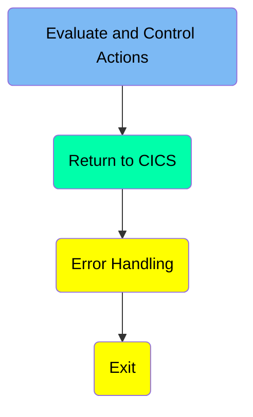
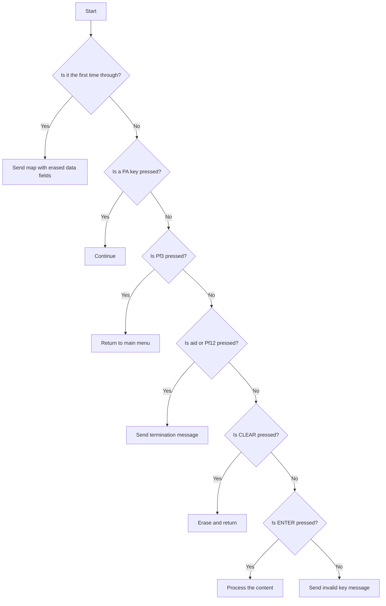
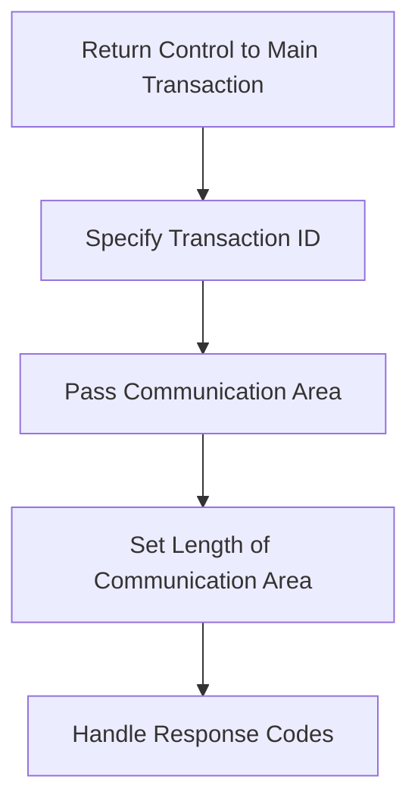
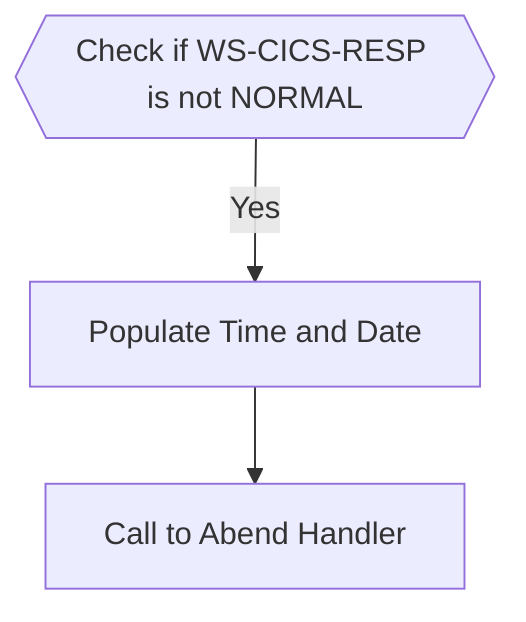

# Transferring Funds (BNK1TFN)

The <SwmToken path="src/base/cobol_src/BNK1TFN.cbl" pos="16:6:6" line-data="       PROGRAM-ID. BNK1TFN.">`BNK1TFN`</SwmToken> program contains the functionality that allows the transfer of funds between accounts within the same bank. This process involves validating the input data, such as account numbers and transfer amounts, ensuring that the accounts are different and valid, and then performing the transfer operation. The program handles various user interactions, including sending maps, processing data, and handling errors or invalid inputs. It ensures that the transfer is executed correctly and updates the account balances accordingly.

The flow starts by evaluating the key pressed by the user. Depending on the key, it performs actions like sending maps with erased data fields, continuing without action, returning to the main menu, sending termination messages, erasing the screen, processing entered content, or notifying the user of an invalid key press. After handling the key press, the program returns control to the main transaction, ensuring the application flow continues smoothly. If an error occurs, it logs the error details and calls the abend handler for further processing.

Here is a high level diagram of the program:



## Evaluate and Control Actions



<SwmSnippet path="/src/base/cobol_src/BNK1TFN.cbl" line="177">

---

### Handling First Time Through

First, the code checks if it is the first time through by evaluating if <SwmToken path="src/base/cobol_src/BNK1TFN.cbl" pos="183:3:3" line-data="              WHEN EIBCALEN = ZERO">`EIBCALEN`</SwmToken> is zero. If it is, it moves low values to <SwmToken path="src/base/cobol_src/BNK1TFN.cbl" pos="184:9:9" line-data="                 MOVE LOW-VALUE TO BNK1TFO">`BNK1TFO`</SwmToken>, sets <SwmToken path="src/base/cobol_src/BNK1TFN.cbl" pos="185:3:5" line-data="                 SET SEND-ERASE TO TRUE">`SEND-ERASE`</SwmToken> to true, and performs <SwmToken path="src/base/cobol_src/BNK1TFN.cbl" pos="186:3:5" line-data="                 PERFORM SEND-MAP">`SEND-MAP`</SwmToken> to send the map with erased data fields.

```cobol
           EVALUATE TRUE

      *
      *       Is it the first time through? If so, send the map
      *       with erased (empty) data fields.
      *
              WHEN EIBCALEN = ZERO
                 MOVE LOW-VALUE TO BNK1TFO
                 SET SEND-ERASE TO TRUE
                 PERFORM SEND-MAP
```

---

</SwmSnippet>

<SwmSnippet path="/src/base/cobol_src/BNK1TFN.cbl" line="189">

---

### Handling PA Key Presses

Moving to the next condition, if a PA key (<SwmToken path="src/base/cobol_src/BNK1TFN.cbl" pos="191:7:7" line-data="              WHEN EIBAID = DFHPA1 OR DFHPA2 OR DFHPA3">`DFHPA1`</SwmToken>, <SwmToken path="src/base/cobol_src/BNK1TFN.cbl" pos="191:11:11" line-data="              WHEN EIBAID = DFHPA1 OR DFHPA2 OR DFHPA3">`DFHPA2`</SwmToken>, or <SwmToken path="src/base/cobol_src/BNK1TFN.cbl" pos="191:15:15" line-data="              WHEN EIBAID = DFHPA1 OR DFHPA2 OR DFHPA3">`DFHPA3`</SwmToken>) is pressed, the program simply continues without any additional action.

```cobol
      *       If a PA key is pressed, just carry on
      *
              WHEN EIBAID = DFHPA1 OR DFHPA2 OR DFHPA3
                 CONTINUE
```

---

</SwmSnippet>

<SwmSnippet path="/src/base/cobol_src/BNK1TFN.cbl" line="195">

---

### Handling <SwmToken path="src/base/cobol_src/BNK1TFN.cbl" pos="195:5:5" line-data="      *       When Pf3 is pressed, return to the main menu">`Pf3`</SwmToken> Key Press

Next, if the <SwmToken path="src/base/cobol_src/BNK1TFN.cbl" pos="195:5:5" line-data="      *       When Pf3 is pressed, return to the main menu">`Pf3`</SwmToken> key (<SwmToken path="src/base/cobol_src/BNK1TFN.cbl" pos="197:7:7" line-data="              WHEN EIBAID = DFHPF3">`DFHPF3`</SwmToken>) is pressed, the program returns to the main menu by executing a CICS RETURN command with the transaction ID 'OMEN'.

```cobol
      *       When Pf3 is pressed, return to the main menu
      *
              WHEN EIBAID = DFHPF3
                 EXEC CICS RETURN
                    TRANSID('OMEN')
                    IMMEDIATE
                    RESP(WS-CICS-RESP)
                    RESP2(WS-CICS-RESP2)
                 END-EXEC
```

---

</SwmSnippet>

<SwmSnippet path="/src/base/cobol_src/BNK1TFN.cbl" line="206">

---

### Handling Aid or <SwmToken path="src/base/cobol_src/BNK1TFN.cbl" pos="206:11:11" line-data="      *       If the aid or Pf12 is pressed, then send a termination">`Pf12`</SwmToken> Key Press

Then, if the aid key (<SwmToken path="src/base/cobol_src/BNK1TFN.cbl" pos="209:7:7" line-data="              WHEN EIBAID = DFHAID OR DFHPF12">`DFHAID`</SwmToken>) or <SwmToken path="src/base/cobol_src/BNK1TFN.cbl" pos="206:11:11" line-data="      *       If the aid or Pf12 is pressed, then send a termination">`Pf12`</SwmToken> key (<SwmToken path="src/base/cobol_src/BNK1TFN.cbl" pos="209:11:11" line-data="              WHEN EIBAID = DFHAID OR DFHPF12">`DFHPF12`</SwmToken>) is pressed, the program performs <SwmToken path="src/base/cobol_src/BNK1TFN.cbl" pos="210:3:7" line-data="                 PERFORM SEND-TERMINATION-MSG">`SEND-TERMINATION-MSG`</SwmToken> and executes a CICS RETURN command to terminate the session.

```cobol
      *       If the aid or Pf12 is pressed, then send a termination
      *       message.
      *
              WHEN EIBAID = DFHAID OR DFHPF12
                 PERFORM SEND-TERMINATION-MSG
                 EXEC CICS
                    RETURN
                 END-EXEC
```

---

</SwmSnippet>

<SwmSnippet path="/src/base/cobol_src/BNK1TFN.cbl" line="216">

---

### Handling CLEAR Key Press

When the CLEAR key (<SwmToken path="src/base/cobol_src/BNK1TFN.cbl" pos="218:7:7" line-data="              WHEN EIBAID = DFHCLEAR">`DFHCLEAR`</SwmToken>) is pressed, the program sends a control command to erase the screen and free the keyboard, then returns control to CICS.

```cobol
      *       When CLEAR is pressed
      *
              WHEN EIBAID = DFHCLEAR
                EXEC CICS SEND CONTROL
                          ERASE
                          FREEKB
                END-EXEC
                EXEC CICS RETURN
                END-EXEC
```

---

</SwmSnippet>

<SwmSnippet path="/src/base/cobol_src/BNK1TFN.cbl" line="227">

---

### Handling ENTER Key Press

When the ENTER key (<SwmToken path="src/base/cobol_src/BNK1TFN.cbl" pos="229:7:7" line-data="              WHEN EIBAID = DFHENTER">`DFHENTER`</SwmToken>) is pressed, the program performs <SwmToken path="src/base/cobol_src/BNK1TFN.cbl" pos="230:3:5" line-data="                 PERFORM PROCESS-MAP">`PROCESS-MAP`</SwmToken> to process the content entered by the user.

```cobol
      *       When enter is pressed then process the content
      *
              WHEN EIBAID = DFHENTER
                 PERFORM PROCESS-MAP

```

---

</SwmSnippet>

<SwmSnippet path="/src/base/cobol_src/BNK1TFN.cbl" line="234">

---

### Handling Invalid Key Press

Finally, if any other key is pressed, the program moves low values to <SwmToken path="src/base/cobol_src/BNK1TFN.cbl" pos="236:9:9" line-data="                 MOVE LOW-VALUES TO BNK1TFO">`BNK1TFO`</SwmToken>, sets an invalid key message to <SwmToken path="src/base/cobol_src/BNK1TFN.cbl" pos="237:14:14" line-data="                 MOVE &#39;Invalid key pressed.&#39; TO MESSAGEO">`MESSAGEO`</SwmToken>, sets <SwmToken path="src/base/cobol_src/BNK1TFN.cbl" pos="239:3:7" line-data="                 SET SEND-DATAONLY-ALARM TO TRUE">`SEND-DATAONLY-ALARM`</SwmToken> to true, and performs <SwmToken path="src/base/cobol_src/BNK1TFN.cbl" pos="240:3:5" line-data="                 PERFORM SEND-MAP">`SEND-MAP`</SwmToken> to notify the user of the invalid key press.

```cobol
      *
              WHEN OTHER
                 MOVE LOW-VALUES TO BNK1TFO
                 MOVE 'Invalid key pressed.' TO MESSAGEO
      *           MOVE 10 TO CUSTNOL
                 SET SEND-DATAONLY-ALARM TO TRUE
                 PERFORM SEND-MAP

```

---

</SwmSnippet>

## Return to CICS

This is the next section of the flow.



<SwmSnippet path="/src/base/cobol_src/BNK1TFN.cbl" line="244">

---

### Return Control to Main Transaction

First, the `RETURN` command is used to pass control back to the main transaction. This is essential for ensuring that the application flow continues as expected after the current processing is complete.

```cobol
      *
      *     Now RETURN
      *
            EXEC CICS
               RETURN TRANSID('OTFN')
               COMMAREA(WS-COMMAREA)
               LENGTH(29)
               RESP(WS-CICS-RESP)
               RESP2(WS-CICS-RESP2)
            END-EXEC.

```

---

</SwmSnippet>

<SwmSnippet path="/src/base/cobol_src/BNK1TFN.cbl" line="247">

---

#### Specify Transaction ID

Next, the <SwmToken path="src/base/cobol_src/BNK1TFN.cbl" pos="248:3:8" line-data="               RETURN TRANSID(&#39;OTFN&#39;)">`TRANSID('OTFN')`</SwmToken> specifies the transaction ID to which control should be returned. This ensures that the correct transaction is resumed.

```cobol
            EXEC CICS
               RETURN TRANSID('OTFN')
               COMMAREA(WS-COMMAREA)
               LENGTH(29)
               RESP(WS-CICS-RESP)
               RESP2(WS-CICS-RESP2)
            END-EXEC.

```

---

</SwmSnippet>

<SwmSnippet path="/src/base/cobol_src/BNK1TFN.cbl" line="247">

---

#### Pass Communication Area

Then, the <SwmToken path="src/base/cobol_src/BNK1TFN.cbl" pos="249:1:6" line-data="               COMMAREA(WS-COMMAREA)">`COMMAREA(WS-COMMAREA)`</SwmToken> passes the communication area, which contains data that needs to be shared between transactions. This is crucial for maintaining the state and context of the application.

```cobol
            EXEC CICS
               RETURN TRANSID('OTFN')
               COMMAREA(WS-COMMAREA)
               LENGTH(29)
               RESP(WS-CICS-RESP)
               RESP2(WS-CICS-RESP2)
            END-EXEC.

```

---

</SwmSnippet>

<SwmSnippet path="/src/base/cobol_src/BNK1TFN.cbl" line="247">

---

#### Set Length of Communication Area

The <SwmToken path="src/base/cobol_src/BNK1TFN.cbl" pos="250:1:4" line-data="               LENGTH(29)">`LENGTH(29)`</SwmToken> sets the length of the communication area to 29 bytes. This ensures that the correct amount of data is passed between transactions.

```cobol
            EXEC CICS
               RETURN TRANSID('OTFN')
               COMMAREA(WS-COMMAREA)
               LENGTH(29)
               RESP(WS-CICS-RESP)
               RESP2(WS-CICS-RESP2)
            END-EXEC.

```

---

</SwmSnippet>

<SwmSnippet path="/src/base/cobol_src/BNK1TFN.cbl" line="247">

---

#### Handle Response Codes

Finally, the <SwmToken path="src/base/cobol_src/BNK1TFN.cbl" pos="251:1:8" line-data="               RESP(WS-CICS-RESP)">`RESP(WS-CICS-RESP)`</SwmToken> and <SwmToken path="src/base/cobol_src/BNK1TFN.cbl" pos="252:1:8" line-data="               RESP2(WS-CICS-RESP2)">`RESP2(WS-CICS-RESP2)`</SwmToken> handle the primary and secondary response codes from the CICS command. These response codes are used to determine if the command was successful or if any errors occurred.

```cobol
            EXEC CICS
               RETURN TRANSID('OTFN')
               COMMAREA(WS-COMMAREA)
               LENGTH(29)
               RESP(WS-CICS-RESP)
               RESP2(WS-CICS-RESP2)
            END-EXEC.

```

---

</SwmSnippet>

### Interim Summary

So far, we saw how the program handles different key presses such as PA keys, <SwmToken path="src/base/cobol_src/BNK1TFN.cbl" pos="195:5:5" line-data="      *       When Pf3 is pressed, return to the main menu">`Pf3`</SwmToken>, aid or <SwmToken path="src/base/cobol_src/BNK1TFN.cbl" pos="206:11:11" line-data="      *       If the aid or Pf12 is pressed, then send a termination">`Pf12`</SwmToken>, CLEAR, ENTER, and other invalid keys, and how it returns control to the main transaction. Now, we will focus on error handling, where the program checks for abnormal CICS responses and processes them accordingly.

## Error Handling



<SwmSnippet path="/src/base/cobol_src/BNK1TFN.cbl" line="255">

---

### Checking CICS Response

First, we check if <SwmToken path="src/base/cobol_src/BNK1TFN.cbl" pos="255:3:7" line-data="           IF WS-CICS-RESP NOT = DFHRESP(NORMAL)">`WS-CICS-RESP`</SwmToken> is not equal to <SwmToken path="src/base/cobol_src/BNK1TFN.cbl" pos="255:13:16" line-data="           IF WS-CICS-RESP NOT = DFHRESP(NORMAL)">`DFHRESP(NORMAL)`</SwmToken>. This condition determines if there was an abnormal response from the CICS transaction.

```cobol
           IF WS-CICS-RESP NOT = DFHRESP(NORMAL)
```

---

</SwmSnippet>

<SwmSnippet path="/src/base/cobol_src/BNK1TFN.cbl" line="262">

---

### Preserving Response Codes

Next, we preserve the response codes by moving <SwmToken path="src/base/cobol_src/BNK1TFN.cbl" pos="263:3:3" line-data="              MOVE EIBRESP    TO ABND-RESPCODE">`EIBRESP`</SwmToken> to <SwmToken path="src/base/cobol_src/BNK1TFN.cbl" pos="263:7:9" line-data="              MOVE EIBRESP    TO ABND-RESPCODE">`ABND-RESPCODE`</SwmToken> and <SwmToken path="src/base/cobol_src/BNK1TFN.cbl" pos="264:3:3" line-data="              MOVE EIBRESP2   TO ABND-RESP2CODE">`EIBRESP2`</SwmToken> to <SwmToken path="src/base/cobol_src/BNK1TFN.cbl" pos="264:7:9" line-data="              MOVE EIBRESP2   TO ABND-RESP2CODE">`ABND-RESP2CODE`</SwmToken>. This ensures that we have the original response codes for logging and debugging.

```cobol
              INITIALIZE ABNDINFO-REC
              MOVE EIBRESP    TO ABND-RESPCODE
              MOVE EIBRESP2   TO ABND-RESP2CODE
```

---

</SwmSnippet>

<SwmSnippet path="/src/base/cobol_src/BNK1TFN.cbl" line="268">

---

### Assigning Application ID

Then, we assign the application ID to <SwmToken path="src/base/cobol_src/BNK1TFN.cbl" pos="268:9:11" line-data="              EXEC CICS ASSIGN APPLID(ABND-APPLID)">`ABND-APPLID`</SwmToken> using the <SwmToken path="src/base/cobol_src/BNK1TFN.cbl" pos="268:1:5" line-data="              EXEC CICS ASSIGN APPLID(ABND-APPLID)">`EXEC CICS ASSIGN`</SwmToken> command. This helps in identifying which application encountered the error.

```cobol
              EXEC CICS ASSIGN APPLID(ABND-APPLID)
              END-EXEC
```

---

</SwmSnippet>

<SwmSnippet path="/src/base/cobol_src/BNK1TFN.cbl" line="271">

---

### Moving Task and Transaction IDs

We move the task number and transaction ID to <SwmToken path="src/base/cobol_src/BNK1TFN.cbl" pos="271:7:11" line-data="              MOVE EIBTASKN   TO ABND-TASKNO-KEY">`ABND-TASKNO-KEY`</SwmToken> and <SwmToken path="src/base/cobol_src/BNK1TFN.cbl" pos="272:7:9" line-data="              MOVE EIBTRNID   TO ABND-TRANID">`ABND-TRANID`</SwmToken> respectively. These values are crucial for tracking the specific task and transaction that failed.

```cobol
              MOVE EIBTASKN   TO ABND-TASKNO-KEY
              MOVE EIBTRNID   TO ABND-TRANID
```

---

</SwmSnippet>

<SwmSnippet path="/src/base/cobol_src/BNK1TFN.cbl" line="274">

---

### Populating Time and Date

We perform the <SwmToken path="src/base/cobol_src/BNK1TFN.cbl" pos="274:3:7" line-data="              PERFORM POPULATE-TIME-DATE">`POPULATE-TIME-DATE`</SwmToken> section to get the current date and time. This is important for logging the exact time of the error.

```cobol
              PERFORM POPULATE-TIME-DATE
```

---

</SwmSnippet>

<SwmSnippet path="/src/base/cobol_src/BNK1TFN.cbl" line="1207">

---

#### Populating Time and Date Details

The <SwmToken path="src/base/cobol_src/BNK1TFN.cbl" pos="1207:1:5" line-data="       POPULATE-TIME-DATE SECTION.">`POPULATE-TIME-DATE`</SwmToken> section uses <SwmToken path="src/base/cobol_src/BNK1TFN.cbl" pos="1212:1:5" line-data="           EXEC CICS ASKTIME">`EXEC CICS ASKTIME`</SwmToken> to get the current time and <SwmToken path="src/base/cobol_src/BNK1TFN.cbl" pos="1216:1:5" line-data="           EXEC CICS FORMATTIME">`EXEC CICS FORMATTIME`</SwmToken> to format it into a readable date and time. This formatted date and time are then used in the abend information.

```cobol
       POPULATE-TIME-DATE SECTION.
       PTD010.
      *
      *    Fomate the date and time
      *
           EXEC CICS ASKTIME
              ABSTIME(WS-U-TIME)
           END-EXEC.

           EXEC CICS FORMATTIME
                     ABSTIME(WS-U-TIME)
                     DDMMYYYY(WS-ORIG-DATE)
                     TIME(WS-TIME-NOW)
                     DATESEP
           END-EXEC.

       PTD999.
           EXIT.
```

---

</SwmSnippet>

<SwmSnippet path="/src/base/cobol_src/BNK1TFN.cbl" line="276">

---

### Moving Date and Time

We move the original date to <SwmToken path="src/base/cobol_src/BNK1TFN.cbl" pos="276:11:13" line-data="              MOVE WS-ORIG-DATE TO ABND-DATE">`ABND-DATE`</SwmToken> and construct a time string from <SwmToken path="src/base/cobol_src/BNK1TFN.cbl" pos="277:3:11" line-data="              STRING WS-TIME-NOW-GRP-HH DELIMITED BY SIZE,">`WS-TIME-NOW-GRP-HH`</SwmToken>, <SwmToken path="src/base/cobol_src/BNK1TFN.cbl" pos="279:1:9" line-data="                     WS-TIME-NOW-GRP-MM DELIMITED BY SIZE,">`WS-TIME-NOW-GRP-MM`</SwmToken>, and <SwmToken path="src/base/cobol_src/BNK1TFN.cbl" pos="279:1:9" line-data="                     WS-TIME-NOW-GRP-MM DELIMITED BY SIZE,">`WS-TIME-NOW-GRP-MM`</SwmToken> to <SwmToken path="src/base/cobol_src/BNK1TFN.cbl" pos="282:3:5" line-data="                     INTO ABND-TIME">`ABND-TIME`</SwmToken>. This provides a complete timestamp for the error.

```cobol
              MOVE WS-ORIG-DATE TO ABND-DATE
              STRING WS-TIME-NOW-GRP-HH DELIMITED BY SIZE,
                    ':' DELIMITED BY SIZE,
                     WS-TIME-NOW-GRP-MM DELIMITED BY SIZE,
                     ':' DELIMITED BY SIZE,
                     WS-TIME-NOW-GRP-MM DELIMITED BY SIZE
                     INTO ABND-TIME
```

---

</SwmSnippet>

<SwmSnippet path="/src/base/cobol_src/BNK1TFN.cbl" line="288">

---

### Assigning Program Name

We assign the current program name to <SwmToken path="src/base/cobol_src/BNK1TFN.cbl" pos="288:9:11" line-data="              EXEC CICS ASSIGN PROGRAM(ABND-PROGRAM)">`ABND-PROGRAM`</SwmToken> using <SwmToken path="src/base/cobol_src/BNK1TFN.cbl" pos="288:1:5" line-data="              EXEC CICS ASSIGN PROGRAM(ABND-PROGRAM)">`EXEC CICS ASSIGN`</SwmToken>. This helps in identifying which program encountered the error.

```cobol
              EXEC CICS ASSIGN PROGRAM(ABND-PROGRAM)
              END-EXEC
```

---

</SwmSnippet>

<SwmSnippet path="/src/base/cobol_src/BNK1TFN.cbl" line="293">

---

### Constructing Freeform Message

We construct a freeform message that includes the error codes and a descriptive message. This message is stored in <SwmToken path="src/base/cobol_src/BNK1TFN.cbl" pos="299:3:5" line-data="                    INTO ABND-FREEFORM">`ABND-FREEFORM`</SwmToken> and is useful for debugging and logging.

```cobol
              STRING 'A010 - RETURN TRANSID(OCCS) FAIL.'
                    DELIMITED BY SIZE,
                    ' EIBRESP=' DELIMITED BY SIZE,
                    ABND-RESPCODE DELIMITED BY SIZE,
                    ' RESP2=' DELIMITED BY SIZE,
                    ABND-RESP2CODE DELIMITED BY SIZE
                    INTO ABND-FREEFORM
```

---

</SwmSnippet>

<SwmSnippet path="/src/base/cobol_src/BNK1TFN.cbl" line="302">

---

### Linking to Abend Handler

Finally, we link to the abend handler program using <SwmToken path="src/base/cobol_src/BNK1TFN.cbl" pos="302:1:1" line-data="              EXEC CICS LINK PROGRAM(WS-ABEND-PGM)">`EXEC`</SwmToken>` `<SwmToken path="src/base/cobol_src/BNK1TFN.cbl" pos="302:3:3" line-data="              EXEC CICS LINK PROGRAM(WS-ABEND-PGM)">`CICS`</SwmToken>` `<SwmToken path="src/base/cobol_src/BNK1TFN.cbl" pos="302:5:5" line-data="              EXEC CICS LINK PROGRAM(WS-ABEND-PGM)">`LINK`</SwmToken>` `<SwmToken path="src/base/cobol_src/BNK1TFN.cbl" pos="302:7:13" line-data="              EXEC CICS LINK PROGRAM(WS-ABEND-PGM)">`PROGRAM(WS-ABEND-PGM`</SwmToken>`) `<SwmToken path="src/base/cobol_src/BNK1TFN.cbl" pos="303:1:5" line-data="                        COMMAREA(ABNDINFO-REC)">`COMMAREA(ABNDINFO-REC`</SwmToken>`)`. This passes the abend information to the handler for further processing.

```cobol
              EXEC CICS LINK PROGRAM(WS-ABEND-PGM)
                        COMMAREA(ABNDINFO-REC)
              END-EXEC
```

---

</SwmSnippet>

*This is an auto-generated document by Swimm 🌊 and has not yet been verified by a human*

<SwmMeta version="3.0.0" repo-id="Z2l0aHViJTNBJTNBY2ljcy1iYW5raW5nLXNhbXBsZS1hcHBsaWNhdGlvbi1jYnNhLUlCTS1EZW1vJTNBJTNBU3dpbW0tRGVtbw==" repo-name="cics-banking-sample-application-cbsa-IBM-Demo"></SwmMeta>
