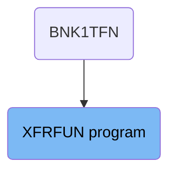
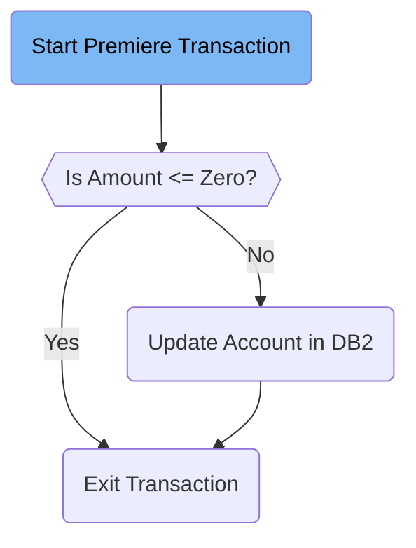

# Transferring Funds (XFRFUN)

The XFRFUN program handles the transfer of funds within the banking application. It starts by setting up the environment, validating the transaction amount, updating the account in the <SwmToken path="src/base/cobol_src/XFRFUN.cbl" pos="279:7:7" line-data="           MOVE  0  TO DB2-DEADLOCK-RETRY.">`DB2`</SwmToken> database, and finally exiting the transaction. The program ensures that the transaction amount is valid before proceeding with the update and handles any potential errors or abends during the process.

The flow starts with setting up the environment for the transaction, then checks if the transaction amount is valid. If the amount is valid, it updates the account in the <SwmToken path="src/base/cobol_src/XFRFUN.cbl" pos="279:7:7" line-data="           MOVE  0  TO DB2-DEADLOCK-RETRY.">`DB2`</SwmToken> database. If the amount is not valid, it flags the transaction as a failure and exits. Finally, it exits the transaction after updating the account or flagging the failure.

## Where is this program used?

This program is used once, in a flow starting from `BNK1TFN` as represented in the following diagram:



Lets' zoom into the flow:



<SwmSnippet path="/src/base/cobol_src/XFRFUN.cbl" line="269">

---

### Start Premiere Transaction

The <SwmToken path="src/base/cobol_src/XFRFUN.cbl" pos="269:1:1" line-data="       PREMIERE SECTION.">`PREMIERE`</SwmToken> section begins by setting up the environment for the transaction. It handles any potential abends and initializes key variables to default values.

```cobol
       PREMIERE SECTION.
       A010.

           EXEC CICS HANDLE ABEND
              LABEL(ABEND-HANDLING)
           END-EXEC.

           MOVE '0' TO HV-ACCOUNT-EYECATCHER.
           MOVE '0' TO HV-ACCOUNT-SORTCODE.
           MOVE '0' TO HV-ACCOUNT-ACC-NO.
           MOVE  0  TO DB2-DEADLOCK-RETRY.
```

---

</SwmSnippet>

<SwmSnippet path="/src/base/cobol_src/XFRFUN.cbl" line="286">

---

### Validate Transaction Amount

The code checks if the transaction amount (<SwmToken path="src/base/cobol_src/XFRFUN.cbl" pos="289:3:5" line-data="           IF COMM-AMT &lt;= ZERO">`COMM-AMT`</SwmToken>) is less than or equal to zero. If true, it flags the transaction as a failure and exits the transaction by performing <SwmToken path="src/base/cobol_src/XFRFUN.cbl" pos="292:3:11" line-data="             PERFORM GET-ME-OUT-OF-HERE">`GET-ME-OUT-OF-HERE`</SwmToken>.

```cobol
      *    If the amount being transferred is negative, then
      *    flag this as a failure and finish.
      *
           IF COMM-AMT <= ZERO
             MOVE 'N' TO COMM-SUCCESS
             MOVE '4' TO COMM-FAIL-CODE
             PERFORM GET-ME-OUT-OF-HERE
           END-IF.
```

---

</SwmSnippet>

<SwmSnippet path="/src/base/cobol_src/XFRFUN.cbl" line="296">

---

### Update Account in <SwmToken path="src/base/cobol_src/XFRFUN.cbl" pos="296:7:7" line-data="           PERFORM UPDATE-ACCOUNT-DB2">`DB2`</SwmToken>

If the transaction amount is valid, the code proceeds to update the account in the <SwmToken path="src/base/cobol_src/XFRFUN.cbl" pos="296:7:7" line-data="           PERFORM UPDATE-ACCOUNT-DB2">`DB2`</SwmToken> database by performing <SwmToken path="src/base/cobol_src/XFRFUN.cbl" pos="296:3:7" line-data="           PERFORM UPDATE-ACCOUNT-DB2">`UPDATE-ACCOUNT-DB2`</SwmToken>.

```cobol
           PERFORM UPDATE-ACCOUNT-DB2
```

---

</SwmSnippet>

<SwmSnippet path="/src/base/cobol_src/XFRFUN.cbl" line="302">

---

### Exit Transaction

Finally, the code exits the transaction by performing <SwmToken path="src/base/cobol_src/XFRFUN.cbl" pos="302:3:11" line-data="           PERFORM GET-ME-OUT-OF-HERE.">`GET-ME-OUT-OF-HERE`</SwmToken>.

```cobol
           PERFORM GET-ME-OUT-OF-HERE.
```

---

</SwmSnippet>

<SwmSnippet path="/src/base/cobol_src/XFRFUN.cbl" line="1726">

---

#### <SwmToken path="src/base/cobol_src/XFRFUN.cbl" pos="1726:1:9" line-data="       GET-ME-OUT-OF-HERE SECTION.">`GET-ME-OUT-OF-HERE`</SwmToken>

The <SwmToken path="src/base/cobol_src/XFRFUN.cbl" pos="1726:1:9" line-data="       GET-ME-OUT-OF-HERE SECTION.">`GET-ME-OUT-OF-HERE`</SwmToken> section handles the termination of the transaction by executing a CICS RETURN command and then performing a GOBACK.

```cobol
       GET-ME-OUT-OF-HERE SECTION.
       GMOOH010.
           EXEC CICS RETURN
           END-EXEC.

           GOBACK.

       GMOOH999.
           EXIT.
```

---

</SwmSnippet>

<SwmSnippet path="/src/base/cobol_src/XFRFUN.cbl" line="308">

---

#### <SwmToken path="src/base/cobol_src/XFRFUN.cbl" pos="308:1:5" line-data="       UPDATE-ACCOUNT-DB2 SECTION.">`UPDATE-ACCOUNT-DB2`</SwmToken>

The <SwmToken path="src/base/cobol_src/XFRFUN.cbl" pos="308:1:5" line-data="       UPDATE-ACCOUNT-DB2 SECTION.">`UPDATE-ACCOUNT-DB2`</SwmToken> section handles the logic for updating the account in the <SwmToken path="src/base/cobol_src/XFRFUN.cbl" pos="308:5:5" line-data="       UPDATE-ACCOUNT-DB2 SECTION.">`DB2`</SwmToken> database. It includes checks for transferring between the same account, updating the 'FROM' account, and updating the 'TO' account. It also handles rollback scenarios in case of failures.

```cobol
       UPDATE-ACCOUNT-DB2 SECTION.
       UAD010.

           MOVE 'N' TO COMM-SUCCESS.
      *
      *    Are we trying to transfer from and to the same account?
      *    We don't allow that.
      *
           IF COMM-FACCNO = COMM-TACCNO
              AND COMM-FSCODE = COMM-TSCODE
      *
      *       Preserve the RESP and RESP2, then set up the
      *       standard ABEND info before getting the applid,
      *       date/time etc. and linking to the Abend Handler
      *       program.
      *
              INITIALIZE ABNDINFO-REC
              MOVE EIBRESP    TO ABND-RESPCODE
              MOVE EIBRESP2   TO ABND-RESP2CODE
      *
      *       Get supplemental information
```

---

</SwmSnippet>

&nbsp;

*This is an auto-generated document by Swimm 🌊 and has not yet been verified by a human*

<SwmMeta version="3.0.0" repo-id="Z2l0aHViJTNBJTNBY2ljcy1iYW5raW5nLXNhbXBsZS1hcHBsaWNhdGlvbi1jYnNhLUlCTS1EZW1vJTNBJTNBU3dpbW0tRGVtbw==" repo-name="cics-banking-sample-application-cbsa-IBM-Demo"></SwmMeta>
